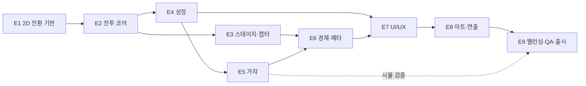
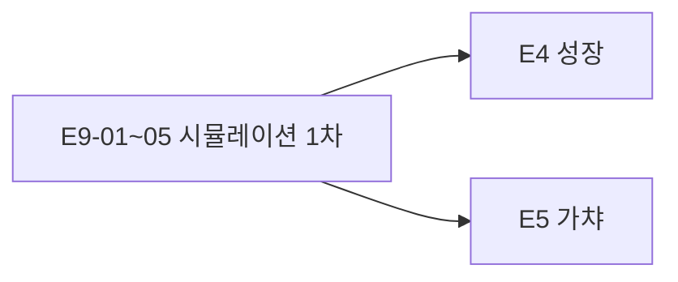

# SoloHero — 개발 에픽 브레이크다운

`gdd.md`의 `Development Epics` 요약 표를 스토리 단위로 전개한 문서다. 수치·공식은 모두 `gdd.md`의 `Number Balancing` 상수표를 단일 출처로 참조하며, 여기에 값을 복사하지 않는다.

**우선순위 표기** M = Must(MVP 필수) / S = Should(MVP+, 여유가 있으면 v1.0에 포함). Should 스토리 10개는 `gdd.md`의 `Scope → MVP+` 표와 일대일 대응한다.

---

## E1. 2D 전환 기반

**목표** 세로 화면에서 앱이 시작되고, 저장 데이터가 원격·로컬로 왕복하며, 기존 v1 데이터를 가진 계정도 진입에 실패하지 않는 상태를 만든다.

**데모 조건** 빈 세로 화면에서 앱이 부팅되고, 값을 바꿔 저장한 뒤 재실행하면 그 값이 복원된다.

| ID | 스토리 | 완료 기준 | 우선순위 |
|---|---|---|---|
| E1-01 | 프로젝트를 Portrait 고정으로 전환한다 | 기기에서 회전해도 세로 유지, 기준 해상도 1080×1920 스케일 동작 | M |
| E1-02 | 2D 렌더 경로로 전환하고 픽셀 퍼펙트 표시를 확보한다 | 32×32 스프라이트가 비정수 배율 없이 선명하게 표시됨 | M |
| E1-03 | 3D 전용 에셋·스크립트·패키지를 정리한다 | 컴파일 경고 없이 빌드 통과, 프로젝트 용량 감소 확인 | M |
| E1-04 | 부트 시퀀스를 구성한다 (초기화 → 익명 인증 → 로드 → 이관 → 오프라인 계산 → 전투 진입) | 각 단계 실패 시 분기가 동작하고 어떤 실패에서도 앱이 멈추지 않음 | M |
| E1-05 | 저장 스키마 v2를 정의한다 (프레스티지 예약 필드 포함) | 전 필드 기본값이 정의되고 신규 유저가 정상 생성됨 | M |
| E1-06 | v1 → v2 이관 경로를 구현한다 | v1 데이터를 가진 계정이 진행도·장비·강화 레벨을 잃지 않고 진입 | M |
| E1-07 | 저장 파이프라인을 이식한다 (원격 + 로컬 백업 + 디바운스 큐) | 저장 트리거 7종이 동작하고 동시 저장 요청이 충돌하지 않음 | M |
| E1-08 | 로드 실패 시 방어 UI를 만든다 | 원격 실패 시 로컬로 시작하고, 데이터가 초기화된 것처럼 보이지 않음 | M |
| E1-09 | 빌드 파이프라인을 세로 설정에 맞춰 갱신한다 | Jenkins와 GitHub Actions 양쪽에서 AAB 산출 성공 | M |
| E1-10 | 앱 시작 → 전투 진입 8초 목표를 계측한다 | 콜드 스타트 10회 평균이 목표 이내 | S |

---

## E2. 전투 코어

**목표** 플레이어 입력 없이 히어로가 전진·교전·처치하는 루프를 완성한다.

**데모 조건** 플레이스홀더 박스 상태로 스테이지 1-1이 무조작으로 클리어된다.

| ID | 스토리 | 완료 기준 | 우선순위 |
|---|---|---|---|
| E2-01 | 히어로를 화면 왼쪽 30% 지점에 고정 배치하고 자동 전진을 구현한다 | 적이 없으면 전진, 이동 속도가 상수로 고정됨 | M |
| E2-02 | 배경 3레이어 패럴랙스와 지면 스크롤을 구현한다 | 전진 시 레이어별 속도 차가 보이고 이음새가 끊기지 않음 | M |
| E2-03 | 적 스폰 규칙을 구현한다 (화면 우측 밖, 간격·동시 최대·누적 총량) | 동시 최대 수를 넘지 않고 누적 스폰이 킬 목표와 일치 | M |
| E2-04 | 최근접 타겟팅을 구현한다 | 히어로보다 오른쪽의 최근접 적을 타겟하고, 사망 시 같은 프레임 재탐색 | M |
| E2-05 | 교전 전환과 사거리 판정을 구현한다 | 사거리 진입 시 정지, 이탈 시 전진 재개 | M |
| E2-06 | 기본 공격과 히트 프레임 판정을 구현한다 | 공격 주기가 공격속도 스탯과 일치, 히트 프레임에 판정 | M |
| E2-07 | 데미지 공식과 크리티컬을 구현한다 | 적 방어력 0 기준 데미지 산출, 최소 데미지 1 보장, 크리 확률·배율이 스탯과 일치 | M |
| E2-08 | 적 반격과 히어로 피격을 구현한다 | 적 공격 주기가 상수와 일치(보스 별도), 피격이 자기 스케일링 비율 감쇄(`DEF_REF = 8 × 적 공격력`)를 따르고 최소 1 보장 | M |
| E2-09 | 히어로 사망 → 자동 재시작을 구현한다 | 사망 연출 후 같은 스테이지 처음부터, HP 전량 회복, 재화 손실 없음 | M |
| E2-10 | 적·데미지 텍스트·이펙트 재사용 풀을 구현한다 | 30분 연속 전투에서 런타임 생성이 0, 메모리 증가 10% 이내 | M |
| E2-11 | 동시 판정 엣지 케이스를 처리한다 (히어로 사망 vs 마지막 적 사망) | 플레이어 유리 판정이 일관되게 적용됨 | S |
| E2-12 | 백그라운드 전환 시 전투 상태를 버리고 복귀 시 재시작한다 | 복귀 후 파밍 스테이지 처음부터 시작, 상태 꼬임 없음 | M |

---

## E3. 스테이지·챕터 진행

**목표** 챕터-스테이지 진행, 보스, 후퇴 파밍, 최고 도달과 파밍 스테이지 분리를 완성한다.

**데모 조건** 1-1부터 1-10 보스까지 진행되고, 보스 실패 후 후퇴 파밍이 동작하며 재실행 후에도 유지된다.

| ID | 스토리 | 완료 기준 | 우선순위 |
|---|---|---|---|
| E3-01 | 전역 스테이지 인덱스 기반 스케일링을 구현한다 | 적 HP·ATK·EXP·스테이지 골드가 공식대로 산출됨 | M |
| E3-02 | 킬 목표와 스테이지 클리어를 구현한다 | 일반 8마리 고정, 클리어 시 골드·EXP 지급 | M |
| E3-03 | 클리어 후 자동 진행을 구현한다 | 대기 시간 후 다음 스테이지 진입, 파밍 지정 시에는 반복 | M |
| E3-04 | 보스 스테이지를 구현한다 (단독 1체, 배율 적용) | 챕터 10번째가 보스이고 배율이 상수표대로 적용됨 | M |
| E3-05 | 보스 등장 연출과 제한 시간을 구현한다 | 연출 후 타이머 시작, 초과 시 실패 판정 | M |
| E3-06 | 보스 실패 팝업을 구현한다 (재도전 / 후퇴, 남은 HP % 표시) | 왜 실패했는지 플레이어가 알 수 있음 | M |
| E3-07 | 후퇴 파밍 모드를 구현한다 | 파밍 스테이지가 직전 일반 스테이지로 고정, 보스 재도전 버튼 상시 노출 | M |
| E3-08 | 최고 도달과 현재 파밍 스테이지를 분리 저장한다 | 최고 도달은 감소하지 않고, 재실행 시 파밍 스테이지에서 시작 | M |
| E3-09 | 스테이지 선택 시트를 구현한다 | 최고 도달 이하 자유 선택, 잠긴 항목은 반응 없음 | M |
| E3-10 | 챕터 해금과 최초 클리어 보상을 구현한다 | 보스 격파 시 다음 챕터 해금 + 젬 지급, 재획득 불가 | M |
| E3-11 | 챕터 테마 5종과 적 구성을 데이터로 정의한다 | 챕터별 배경·적 조합이 데이터로 교체 가능 | M |
| E3-12 | 챕터 6 이상 테마 순환 재사용을 구현한다 | 무한 확장에서 테마가 순환되고 수치는 공식이 계속 적용됨 | S |
| E3-13 | 같은 스테이지 3회 연속 실패 시 제안을 띄운다 | 보스는 후퇴 파밍을 기본 포커스로, 일반 스테이지는 한 단계 하향 파밍을 제안 | S |

---

## E4. 성장 시스템

**목표** 히어로 레벨, 강화 4레인, 장비 장착·합산, 스킬 3종을 완성한다.

**데모 조건** 강화 1회가 전투 소요 시간을 줄이는 것이 계측으로 확인된다.

| ID | 스토리 | 완료 기준 | 우선순위 |
|---|---|---|---|
| E4-01 | 히어로 레벨과 EXP를 구현한다 | 요구 EXP 공식대로 레벨업, HP·ATK 가산, 전투 중 즉시 반영 | M |
| E4-02 | 강화 4레인을 구현한다 | 비용 `baseCost × 1.12^level` 일치, HP·ATK·DEF는 `×1.16^level` 승산·상한 없음, 공격속도는 가산·최대 100에서 MAX 잠금 | M |
| E4-03 | 강화 연타 방어를 구현한다 | 10회 연타에서 골드 음수·중복 적용 없음 | M |
| E4-04 | 장비 16종을 데이터로 정의한다 (4슬롯 × 4등급, 등급 배율) | 슬롯별 담당 스탯과 배율이 상수표대로 적용됨 | M |
| E4-05 | 장비 장착·해제·교체를 구현한다 | 슬롯별 택1, 하향 장착 허용, 즉시 스탯 반영 | M |
| E4-06 | 스탯 합산 순서를 구현한다 (가산 후 승산, 버프는 합산 후 1회 승산) | UI 합산 요약과 전투 실효값이 일치 | M |
| E4-07 | 스킬 3종을 구현한다 (계수·쿨다운·범위) | 각 스킬 효과가 상수표대로 동작 | M |
| E4-08 | 스킬 자동 발동 조건을 구현한다 | 스킬별 조건이 다르게 동작하고, 동시 준비 시 순차 발동 | M |
| E4-09 | 스킬 수동 탭 발동을 구현한다 | 쿨다운 완료 시 즉시 발동, 쿨다운 중 무반응 + 잔여 시간 표시 | M |
| E4-10 | 스킬 해금을 히어로 레벨로 게이트한다 | 해금 레벨 도달 시 버튼 활성 + 배지 | M |
| E4-11 | 스킬 레벨업을 구현한다 (최대 10, 레벨당 계수 +10%) | 골드 차감, 계수 상승, 쿨다운 불변 | M |
| E4-12 | 전투 함성 버프 갱신 규칙을 구현한다 | 재발동 시 지속 시간 갱신, 배율 중첩 없음 | M |
| E4-13 | 성장 항목별 저장 트리거를 연결한다 | 강화·장착·스킬 레벨업 직후 저장 완료 | M |

---

## E5. 가챠

**목표** 정규분포 + 천장 가챠를 구현하고, 게임 내 확률 공시가 시뮬레이션과 일치하게 만든다.

**데모 조건** 100회 연속 뽑기에서 Legendary가 최소 1회 보장되고, pity 구간별 분포가 공시표와 오차 1%p 이내로 일치한다.

| ID | 스토리 | 완료 기준 | 우선순위 |
|---|---|---|---|
| E5-01 | 정규분포 샘플 생성을 구현한다 (Box-Muller, σ 상수) | 단위 테스트로 평균·표준편차가 기대값과 일치 | M |
| E5-02 | pity 기반 μ 이동을 구현한다 | pity 0에서 μ 하한, 100 직전에서 μ 상한에 수렴 | M |
| E5-03 | 최근접 매칭 등급 결정을 구현한다 | 가중치 4개에 대해 최대 score 등급이 선택됨 | M |
| E5-04 | 천장을 구현한다 (100회 도달 시 Legendary 확정 + 카운터 리셋) | 천장 전 Legendary 획득으로는 리셋되지 않음 | M |
| E5-05 | 슬롯 균등 선택을 구현한다 | 4슬롯이 각 25%로 선택됨 (10만 회 시뮬 검증) | M |
| E5-06 | 1회 뽑기를 구현한다 (비용 차감 → 결과 확정 → 지급) | 골드 부족 시 버튼 비활성, 연타 방어, 결과 저장 | M |
| E5-07 | 10연 뽑기를 구현한다 (전액 선차감, 10건 pity 누적) | 중간 부족 발생 없음, 10건 안에서 천장 발동 가능 | M |
| E5-08 | 젬 10연 결제 경로를 구현한다 | 젬 차감 후 동일 결과 처리 | S |
| E5-09 | 자동 장착 규칙을 구현한다 | 상위 등급이면 자동 장착, 아니면 인벤 보관, 토스트 문구 일치 | M |
| E5-10 | 중복 장비 자동 환급을 구현한다 | 등급별 환급액 지급, 인벤토리 미증가 | M |
| E5-11 | 가챠 연출 5단계를 구현한다 (1회 / 10연) | 10연에 전체 건너뛰기 제공, 연출 중 이탈 시 결과 보존 | M |
| E5-12 | 천장 진행도와 μ 위치를 UI에 상시 노출한다 | `천장까지 N회` 게이지와 μ 막대가 실제 값과 일치 | M |
| E5-13 | 확률 공시표를 게임 내에서 열람 가능하게 한다 | pity 0/25/50/75/99 구간 표가 표시되고 시뮬 결과와 일치 | M |
| E5-14 | 10만 회 이상 Monte Carlo 시뮬레이션을 수행하고 결과를 기록한다 | 구간별 등급 확률표 산출, 공시표와 대조 완료 | M |
| E5-15 | 가챠 로직 단위 테스트를 작성한다 | 분포·μ 이동·최근접 매칭·천장 4항목 커버 | M |

---

## E6. 경제·메타

**목표** 골드·젬 경제, 오프라인 보상, 광고 슬롯 3종을 완성한다.

**데모 조건** 앱 종료 10분 후 재실행 시 보상이 정확히 계산되고 광고 2배가 동작한다.

| ID | 스토리 | 완료 기준 | 우선순위 |
|---|---|---|---|
| E6-01 | 골드 소스·싱크를 전부 연결한다 | 7개 소스와 3개 싱크가 모두 동작하고 잔고가 음수가 되지 않음 | M |
| E6-02 | 젬 소스·싱크를 연결한다 | 챕터·보스 최초 보상, 광고, 10연, 골드 패키지 | M |
| E6-03 | 오프라인 경과 시간 계산을 구현한다 (UTC 기준, 상한 적용) | 10분 → 600초, 6시간 초과 → 상한 고정 | M |
| E6-04 | 오프라인 초당 획득량을 파밍 스테이지에 연동한다 | 1-1에서 초당 1골드, 진행 시 비례 증가 | M |
| E6-05 | 오프라인 보상 팝업을 구현한다 (일반 수령 / 광고 2배) | 상한 게이지 표시, 수령 직후 저장 | M |
| E6-06 | 최소 경과 시간 미만은 팝업 없이 지급한다 | 60초 미만에서 팝업이 뜨지 않음 | M |
| E6-07 | 시간 조작 방어를 구현한다 (음수 / 상한 2배 초과) | 3가지 조작 케이스에서 크래시·음수 골드 없음, 기준 시각 재설정 | M |
| E6-08 | 미수령 상태 유지를 구현한다 | 팝업을 닫지 않고 종료해도 이중 계산되지 않음 | M |
| E6-09 | 광고 슬롯 A-1(오프라인 2배)을 구현한다 | 정확히 2배 지급, 1일 5회 제한, 실패 시 일반 수령 유지 | M |
| E6-10 | 광고 슬롯 A-2(젬 획득)를 구현한다 | 젬 지급, 1일 5회, 이탈 시 미지급·횟수 미차감 | M |
| E6-11 | 광고 슬롯 A-3(골드 부스터)를 구현한다 | 10분간 스테이지 골드 2배, 1일 3회, 남은 시간 표시 | S |
| E6-12 | 광고 일일 제한 리셋을 구현한다 (로컬 자정 기준) | 자정 경과 후 횟수 복구 | M |
| E6-13 | 광고 로드 실패·이탈 처리를 통일한다 | 모든 슬롯에서 일반 경로가 항상 유지되고 토스트 문구가 일관됨 | M |
| E6-14 | 실제 광고 유닛 ID로 교체한다 | 테스트 ID가 빌드에 남지 않음 | M |
| E6-15 | Analytics 이벤트를 연결한다 | 게임플레이 지표 12개를 수집 가능한 이벤트 집합 정의·발화 | S |

---

## E7. UI/UX 세로 레이아웃

**목표** 세로 1080×1920에서 한 손 도달 범위 안에 모든 조작을 배치한다.

**데모 조건** 노치·펀치홀 기기에서 모든 화면이 안전 영역을 침범하지 않고, 패널 전환이 하나만 열림 규칙을 지킨다.

| ID | 스토리 | 완료 기준 | 우선순위 |
|---|---|---|---|
| E7-01 | 세로 레이아웃 그리드를 확정한다 (전투 뷰 약 55%, 스킬바, 패널 높이, 탭바) | 영역 비율이 기기 종횡비 변화에서도 유지됨 | M |
| E7-02 | 안전 영역 보정을 적용한다 | 노치·홈 인디케이터 영역에 조작 요소가 없음 | M |
| E7-03 | 전투 HUD를 구현한다 (골드·젬·킬 진행·HP·스테이지 바) | 값이 실시간 반영되고 큰 수 표기 규칙 적용 | M |
| E7-04 | 하단 탭바 5개와 패널 슬라이드를 구현한다 | 한 패널만 열림, 재탭 시 닫힘, 슬라이드 방향·시간 일관 | M |
| E7-05 | 캐릭터 패널(강화 4행 + 합산 스탯 요약)을 구현한다 | 행별 비용·레벨·MAX 상태 표시, 합산 요약이 수식과 일치 | M |
| E7-06 | 장비 패널(4슬롯 + 인벤토리 목록)을 구현한다 | 슬롯 탭으로 교체, 등급 색상 적용 | M |
| E7-07 | 가챠 패널을 구현한다 (1회·10연 버튼, 천장 게이지, 확률 공시 진입) | 비용 표시, 부족 시 비활성, 공시표 열람 가능 | M |
| E7-08 | 스킬 패널을 구현한다 (3종 레벨업·해금 상태) | 잠긴 스킬은 해금 조건 표시 | M |
| E7-09 | 설정 패널을 구현한다 (BGM·SFX·이펙트 축소·30fps·계정 정보) | 설정이 저장되고 재실행 후 유지됨 | M |
| E7-10 | 스킬 버튼 3개를 전투 화면 하단에 배치한다 | 쿨다운 잔여 시간 표시, 엄지 도달 범위 내 | M |
| E7-11 | 팝업 6종을 구현한다 (오프라인 보상, 보스 등장, 보스 실패, 광고 확인, 종료 확인, 스테이지 선택) | 각 팝업이 뒤로가기로 닫히고 중첩되지 않음 | M |
| E7-12 | 토스트 시스템을 구현한다 | 자동 장착·인벤 보관·환급·부족·광고 실패 문구가 큐로 순차 표시 | M |
| E7-13 | 튜토리얼 3단계 힌트를 구현한다 | 스킵 가능, 완료 저장, 다른 조작을 차단하지 않음 | M |
| E7-14 | Android 뒤로가기 정책을 구현한다 | 팝업 → 패널 → 종료 확인 순서, 전투 중 즉시 종료되지 않음 | M |
| E7-15 | 전역 연타 방어를 적용한다 | 처리 중 버튼 비활성이 모든 소비 버튼에 일관 적용 | M |
| E7-16 | 큰 수 표기 포맷을 구현한다 (K/M/B/T → 알파벳 접미어) | 1,000 미만 정수, 이상 소수 1자리 | M |
| E7-17 | 문자열을 키-값 테이블로 분리한다 | 하드코딩 문자열 0, v1.1 다국어 대응 여지 확보 | S |

---

## E8. 아트·연출 통합

**목표** 플레이스홀더를 실제 픽셀아트 에셋으로 교체하고 연출·오디오를 붙인다.

**데모 조건** 전 화면에 플레이스홀더 박스가 남아 있지 않고, 이펙트 축소 모드가 동작한다.

| ID | 스토리 | 완료 기준 | 우선순위 |
|---|---|---|---|
| E8-01 | 무료 에셋을 조사하고 라이선스 관리표를 만든다 | 후보별 출처·라이선스·상업적 사용 가능 여부 기록 | M |
| E8-02 | 히어로 스프라이트와 8클립을 통합한다 | Idle/Run/Attack/Hit/Die/Skill 1~3 동작 | M |
| E8-03 | 일반 적 8종을 통합한다 | 종별 5클립 동작, 챕터 구성에 배치됨 | M |
| E8-04 | 보스 3종을 통합한다 (2종은 변형 재사용) | 크기·색상 변형이 원본과 구분됨 | M |
| E8-05 | 챕터 배경 5테마(3패럴랙스 + 지면)를 통합한다 | 이음새 없이 무한 스크롤 | M |
| E8-06 | 히트 프레임 이벤트를 클립에 심는다 | 판정 타이밍이 시각과 일치 | M |
| E8-07 | 장비 아이콘 16종과 등급 색상을 적용한다 | 슬롯·등급이 아이콘만으로 구분됨 | M |
| E8-08 | 전투 VFX를 구현한다 (히트 플래시, 크리티컬, 스킬 3종, 사망) | 재사용 풀에서 공급, 런타임 생성 0 | M |
| E8-09 | 데미지 텍스트와 골드 카운트업을 구현한다 | 크리티컬은 별도 색·크기, 궤적 연출 | M |
| E8-10 | 가챠 등급 파티클 4종과 카드 뒤집기를 구현한다 | Epic 이상에서 카메라 셰이크 동반 | M |
| E8-11 | 강화 성공 펀치와 레벨업 링을 구현한다 | 성장 행위마다 시각 피드백 존재 | M |
| E8-12 | 한글 픽셀 폰트를 적용한다 | 한글·숫자·영문이 모두 픽셀 톤으로 표시됨 (대안: 숫자·영문만 픽셀) | M |
| E8-13 | BGM 6곡과 SFX 17종을 통합한다 | 개별 음소거가 동작 | S |
| E8-14 | 무음 플레이 검증을 수행한다 | 오디오 없이 전투 정보가 전부 시각으로 전달됨 | M |
| E8-15 | 이펙트 축소 모드와 30fps 모드를 구현한다 | 파티클·셰이크만 제거되고 데미지 텍스트는 유지 | M |
| E8-16 | 스프라이트 임포트 규약을 통일한다 (필터·압축·PPU·아틀라스) | 픽셀 퍼펙트가 전 화면에서 유지되고 드로우콜 목표 이내 | M |

---

## E9. 밸런싱·QA·출시

**목표** 목표 곡선을 시뮬레이션으로 검증하고, 출시 게이트를 전부 통과한다.

**데모 조건** 목표 곡선 체크포인트 달성 + Critical 0 + AAB 설치·실행 성공.

| ID | 스토리 | 완료 기준 | 우선순위 |
|---|---|---|---|
| E9-01 | 밸런스 시뮬레이터를 작성한다 | 상수표를 입력으로 스테이지별 누적 시간·골드 잔고·강화 추이 출력. **E4 착수 전에 1차 수행한다** | M |
| E9-02 | 검증 항목 V-1 ~ V-7을 수행하고 상수를 조정한다 | 조정 이력(초기값 → 이유 → 최종값)이 기록됨 | M |
| E9-03 | 목표 곡선 체크포인트를 검증한다 | 1일 1-10 / 3일 챕터 3 / 7일 챕터 5 달성 | M |
| E9-04 | 벽의 위치와 돌파 비용을 검증한다 | 1-10이 첫 벽으로 작동하고, 보스 돌파에 필요한 추가 파밍이 목표 범위(약 40%) 안 | M |
| E9-05 | 24시간 골드 소비율을 검증한다 | 획득량의 90% 이상 소비 | M |
| E9-06 | 단위 테스트 세트를 완성한다 (가챠 분포, 강화 비용, 오프라인 계산, 저장 이관, 큰 수 포맷) | 5개 영역 전부 통과 | M |
| E9-07 | 스모크 시나리오를 작성·수행한다 | 신규/기존 진입 10회 중 10회 성공 | M |
| E9-08 | 강제 종료 시나리오를 수행한다 | 20회 반복에서 핵심 데이터 유실 0 | M |
| E9-09 | 30분 방치 프로토콜을 수행한다 | FPS 저하 10% 이내, 진행 멈춤 없음 | M |
| E9-10 | 2시간 방치 프로토콜을 수행한다 | 크래시 없음, 메모리 증가 20% 이내 | M |
| E9-11 | 세로·보스·후퇴·이관·광고 실패 시나리오를 추가한다 | 신규 시나리오 전부 통과 | M |
| E9-12 | 기기 매트릭스 테스트를 수행한다 (저·중·고사양, 노치·펀치홀) | 각 기기에서 레이아웃·성능 목표 충족 | M |
| E9-13 | 버그 심각도 정의와 출시 게이트를 적용한다 | Critical 0, Major 목록 0 | M |
| E9-14 | 스토어 자산을 준비한다 (아이콘, 스크린샷, 설명, 개인정보처리방침) | Google Play 등록 필드 전부 충족 | M |
| E9-15 | 확률 공시 정책 준수를 확인한다 | 게임 내 공시표가 스토어 정책 요구 형식을 만족 `[확인 필요]` | M |
| E9-16 | 광고 정책 항목을 확인한다 | 보상형 광고 표기·연령 등급·데이터 수집 고지 완료 `[확인 필요]` | M |
| E9-17 | 최소 지원 Android 버전을 확정한다 | 시장 점유율 근거와 함께 기록 | S |
| E9-18 | 릴리스 AAB를 빌드·설치·실행한다 | 개발 기기에서 성공 | M |
| E9-19 | 메모리 절대치와 드로우콜을 계측한다 | 2시간 방치 후 400 MB 이하, 전투 화면 드로우콜 120 이하 | M |
| E9-20 | 첫 세션 5분 체크포인트를 검증한다 | 무경험자 기준 5분 내 스테이지 1-5 도달 + 강화 3회 + 가챠 1회 | M |
| E9-21 | 광고 없이 완주 가능성을 검증한다 | 광고를 한 번도 보지 않는 조건으로 챕터 5 보스까지 도달 가능 | M |

---

## 에픽 간 의존 관계

**병렬 가능 구간** E3(진행)과 E4(성장)는 E2 완료 후 병렬 진행이 가능하다.

**E9의 시뮬레이션 작업은 앞으로 당긴다.** 골드 → 파워 변환 구조는 결정되었지만(강화 승산화), 목표 곡선 달성 여부는 아직 미검증이다. 상수가 흔들린 상태로 E4(강화)·E5(가챠 경제)를 구현하면 밸런스 값과 UI 표기를 전부 다시 만져야 하므로, E9-01 ~ E9-05를 E4 착수 전에 1차 수행한다.

**스토리 총계** 9 에픽 / 132 스토리 (Must 122 · Should 10)

| 에픽 | 스토리 수 | Must | Should |
|---|---|---|---|
| E1 | 10 | 9 | 1 |
| E2 | 12 | 11 | 1 |
| E3 | 13 | 11 | 2 |
| E4 | 13 | 13 | 0 |
| E5 | 15 | 14 | 1 |
| E6 | 15 | 13 | 2 |
| E7 | 17 | 16 | 1 |
| E8 | 16 | 15 | 1 |
| E9 | 21 | 20 | 1 |
| **합계** | **132** | **122** | **10** |
