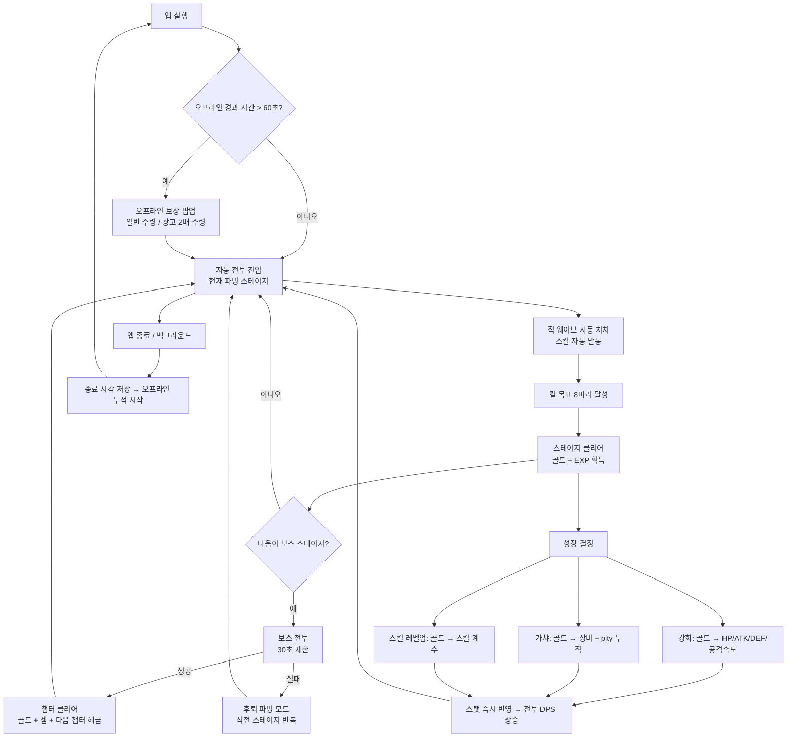
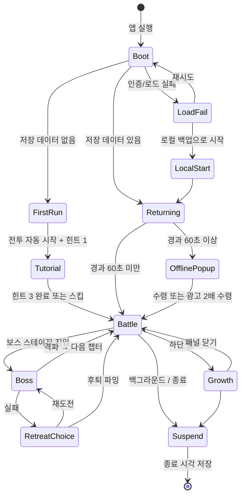

# SoloHero - Game Design Document

**Author:** Tae-jun
**Game Type:** Idle/Incremental (주축) + RPG (병합)
**Target Platform(s):** Android — Google Play, AAB / Portrait 1080×1920

---

## Executive Summary

### Core Concept

세로 화면 픽셀아트 2D 횡스크롤 방치형 RPG. 히어로는 화면 오른쪽으로 자동 전진하며 등장하는 적 웨이브를 스스로 처치하고, 플레이어는 전투를 조작하지 않는다. 플레이어의 행동은 **성장 결정**뿐이다 — 골드를 강화에 넣을지 장비 가챠에 넣을지, 어느 스테이지를 파밍할지, 광고를 볼지.

게임의 심장은 두 가지다. 첫째, 앱을 끈 시간이 골드로 환산되는 **오프라인 축적**(최대 6시간). 둘째, 균일 난수가 아닌 **정규분포 + 천장 가챠** — 뽑기를 거듭할수록 분포의 평균(μ)이 상위 등급 쪽으로 이동하고, 100회에 Legendary가 보장된다. 플레이어는 "운"이 아니라 "누적된 진행도"가 결과를 밀어올리는 것을 확률 공시표와 진행도 게이지로 직접 본다.

한 판의 리듬은 짧다. 일반 스테이지 1회는 약 25초, 챕터당 10스테이지의 마지막이 보스다. 보스에서 막히면 좌절 대신 **후퇴(Retreat) 파밍 모드**로 전환되어 직전 스테이지를 반복하며 다시 강해진다.

### Target Audience

| 페르소나 | 프로필 | 플레이 동기 | 설계 함의 |
|---|---|---|---|
| **P-A. 출퇴근 방치러** (주 타깃) | 25~40세 모바일 게이머, 하루 3~5회 실행 × 회당 2~5분, 한 손 세로 조작 선호. 버섯커 키우기·세븐나이츠 키우기 경험 | 짧은 틈에 "숫자가 늘어난 것"을 확인하는 만족. 전투 조작은 피로로 인식 | 세로 1손 레이아웃, 앱 켜자마자 3탭 안에 성장 완료, 전투 무조작 |
| **P-B. 확률 분석러** (보조 타깃) | 가챠 확률 구조에 흥미, 기댓값·천장 계산을 즐기고 커뮤니티에 공유 | 확률이 투명하게 공시되고, 자기 진행도가 확률을 바꾸는 구조 | pity 진행도 게이지 상시 노출, 확률 공시표를 게임 내에서 열람 가능 |
| **P-C. 픽셀아트 취향자** (부수) | 레트로 픽셀 연출·도트 이펙트를 선호 | 비주얼 자체가 체류 이유 | 픽셀 퍼펙트 유지, 히트 플래시·데미지 텍스트 연출 품질 |

**세션 설계**

| 단위 | 플레이어가 하는 일 | 체감 목표 |
|---|---|---|
| **3분** (앱 켜고 끄기 1회) | 오프라인 보상 수령(광고 2배 선택) → 강화 2~4회 → 가챠 1~3회 → 장비 장착 확인 → 종료 | "짧게 들어와도 확실히 세졌다" |
| **15분** (한 자리에서) | 위 + 스테이지 5~10개 진행, 보스 1회 도전, 스킬 레벨업, 막히면 후퇴 파밍 | "벽이 있었는데 넘었다" |
| **하루** (누적 4~5세션) | 챕터 절반~1개 진도, 광고 슬롯 소진, 젬 누적 → 며칠에 1회 10연 가챠 | "하루 치 진도가 눈에 보인다" |

### Unique Selling Points (USPs)

1. **정규분포 + 천장 가챠.** 등급을 임계 확률표로 뽑지 않고, Box-Muller 정규분포 샘플과 장비별 weight의 최근접 매칭으로 결정한다. pity 누적이 μ를 0.3 → 0.8로 밀어올려, 뽑을수록 상위 등급 확률이 연속적으로 상승한다. 100회 천장에서 Legendary 보장 후 리셋.
2. **껐던 시간이 복귀 보너스가 된다.** 최대 6시간까지 골드가 쌓이고, 초당 획득량이 현재 파밍 스테이지에 연동되어 진행할수록 방치 수익도 커진다. 광고 1회로 2배. 주 수입은 온라인 파밍이고 오프라인은 보조이므로, 방치만으로 진행이 끝나버리지 않는다.
3. **세로 한 손 + 25초 스테이지.** 경쟁작 다수가 가로 기준인 반면 전 화면을 한 손 세로로 설계한다. 스테이지 1회 25초, 챕터 10스테이지로 "진도"를 초 단위로 체감시킨다.
4. **막혀도 루프가 끊기지 않는다.** 보스 실패가 게임 오버가 아니라 후퇴 파밍 모드 진입이다. 플레이어는 항상 다음에 할 일이 있다.

---

## Goals and Context

### Project Goals

| # | 목표 | 정량 기준 |
|---|---|---|
| G-1 | 1인 개발로 Google Play 출시 가능한 완성도의 v1.0을 낸다 | AAB 빌드·설치·실행 성공, Critical 버그 0 |
| G-2 | 방치형 핵심 루프가 30분 연속 플레이에서 성립한다 | 진행 멈춤·메모리 폭증·치명 오류 없음, 30분 내 성장 체감 |
| G-3 | 저장 신뢰성을 확보한다 | 강제 종료 20회 시나리오에서 핵심 데이터 유실 0 |
| G-4 | 정규분포 가챠를 검증 가능한 형태로 공시한다 | 10만 회 이상 Monte Carlo 결과와 게임 내 공시표 일치 |
| G-5 | MVP 콘텐츠 분량을 확보한다 | 챕터 5개 × 10스테이지 = 50스테이지, 적 8종·보스 3종·장비 16종·스킬 3종 |

### Background and Rationale

SoloHero는 쿼터뷰 **3D** 방치형 액션 RPG로 개발되어 전투·스테이지·가챠·인벤토리·Firebase 저장·오프라인 보상까지 동작하는 상태에 도달했다(약 5,900줄 / 49개 스크립트). 3D 모델·Animator 교체 단계에서 1인 개발로 감당 가능한 아트 파이프라인이 아니라는 판단이 서면서, **2D 세로 픽셀아트로 전면 피벗**하기로 결정했다.

피벗의 근거는 세 가지다.

1. **아트 비용.** 3D 모델·리깅·애니메이션 교체는 1인 개발의 실질 병목이었다. 픽셀아트 무료 에셋은 확보·교체·플레이스홀더 대체가 훨씬 싸다.
2. **장르 정합성.** 조작을 최소화하는 방치형에서 3D 쿼터뷰 이동·NavMesh 추적은 비용만 크고 체감 가치가 낮았다. 2D 횡스크롤 자동 전진은 "진도"를 가장 값싸게 보여주는 표현이다.
3. **차별화.** 레퍼런스 게임 Soul Strike를 포함한 경쟁작 다수가 가로 화면이다. 세로 한 손 플레이는 출퇴근 세션과 맞물리는 실질 차별점이다.

**계승과 폐기가 명확히 갈린다.** 정규분포 가챠, 오프라인 보상, 광고 2배, 저장 아키텍처(원격 + 로컬 백업 + 디바운스), 빌드 파이프라인, Firebase/AdMob 인프라는 계승한다. 3D 전투(NavMesh·구체 판정), 가로 레이아웃 UI 구현, 3D 에셋, 선형 강화·스테이지 공식은 폐기한다.

**레퍼런스에서 가져올 것 / 안 가져올 것**

| 요소 | Soul Strike | SoloHero 판단 |
|---|---|---|
| 하단 탭 → 패널 슬라이드업, 하나만 열림 | 하단 5탭, 화면 ~50% 슬라이드 | **가져온다.** 구조만 계승, 세로 그리드로 재구성 |
| Chapter-Stage 진행 포맷 | 1-1 ~ 6-100 | **가져온다.** 단 챕터당 10스테이지로 축소 |
| 천장 가챠 | N회 후 최상위 보장 | **가져온다.** 100회 Legendary 보장 |
| 오프라인 보상 + 광고 2배 | 동일 | **가져온다.** MVP In |
| 가로 화면이 차별점 | "lean into it fully" | **안 가져온다.** 세로 확정 |
| 능동 스킬로 손맛 | "pure idle is boring" | **부분 수용.** 스킬 자동 발동을 기본으로 두고, 탭으로 즉시 발동만 허용 |
| 소환풀 5종 분리 (Job/Skill/Companion/Artifact/Pet) | 다중 풀 | **안 가져온다.** v1.1+ 후보 |
| 성장 4계층 (Training/Traits/Awakening/Constellation) | 다층 메타 | **안 가져온다.** v1.2 프레스티지로 대체 설계 |
| 코스메틱 ~999종, 배틀패스 | 수익화 축 | **안 가져온다.** v1.1+ |
| 최적화가 불만 1위였다는 교훈 | 드로우콜·파티클 통제 | **가져온다.** 성능 예산을 목표치로 명시 |

---

## Core Gameplay

### Game Pillars

| # | 필러 | 정의 | 이 필러가 기각하는 것 |
|---|---|---|---|
| **P1** | **손을 떼도 성장한다** (Zero-Input Progress) | 전투는 플레이어 입력 없이 성립한다. 앱을 꺼도 골드가 쌓인다. 플레이어의 입력은 전투가 아니라 성장 결정에만 쓰인다 | 이동 조작, 타이밍 회피, 수동 기본 공격, 클리커 탭 |
| **P2** | **25초 스테이지, 한 손 세로** (One-Thumb Portrait Rhythm) | 일반 스테이지 1회 약 25초. 모든 화면은 세로 1080×1920에서 한 손 엄지 도달 범위 안에 있다 | 가로 전용 HUD, 양손 조작, 긴 스테이지, 화면 상단 주요 버튼 |
| **P3** | **확률이 보이는 정규분포 가챠** (Transparent Gaussian Gacha) | 가챠 결과는 균일 난수가 아니라 누적 진행도가 평균을 밀어올린 정규분포에서 나온다. 그 구조를 게임 내에서 공시한다 | 숨겨진 확률, 진행도와 무관한 독립 시행, 확률 미공시 |
| **P4** | **벽과 돌파의 리듬** (Wall and Break) | 난이도 성장률이 수익 성장률보다 높아 의도적 정체 구간이 생긴다. 정체는 강화·장비·스킬 중 하나를 골라 돌파한다. 막힘은 실패가 아니라 파밍 전환이다 | 무저항 우상향 곡선, 보스 실패 시 게임 오버, 재화 단일 소비처 |

**추적 체인.** Core Concept → 4개 필러 → 핵심 루프 → 각 시스템 → 개발 에픽. 어떤 필러에도 봉사하지 않는 메카닉은 범위 초과로 취급한다.

**필러를 4개로 둔 이유.** 3개가 권장 상한이지만, P2(세로 한 손 리듬)를 빼면 세로 화면·25초 스테이지·엄지 도달 범위라는 형식 제약이 어떤 필러에도 묶이지 않고, P4(벽과 돌파)를 빼면 난이도 곡선과 골드 소비처 경쟁이 근거를 잃는다. 넷 다 실제로 기각 결정을 내리는 데 쓰이므로 슬로건이 아니다.

### Core Gameplay Loop



**각 단계의 체감 목표**

| 단계 | 체감 목표 | 실패 신호 |
|---|---|---|
| 오프라인 보상 수령 | "안 하고 있었는데도 벌어놨다" | 보상이 강화 1회 비용도 안 됨 |
| 자동 전투 | "내가 안 눌러도 잘 싸운다" | 히어로가 멈춰 보임, 적이 안 죽음 |
| 스테이지 클리어 | "진도가 초 단위로 나간다" | 1스테이지가 1분을 넘김 |
| 성장 결정 | "무엇에 쓸지 고민된다" | 소비처가 하나뿐이라 고민이 없음 |
| 스탯 반영 | "쓴 만큼 바로 세졌다" | 강화 후 전투 시간이 그대로 |
| 보스 | "이번엔 넘을 것 같다" | 왜 졌는지 모름 |
| 후퇴 파밍 | "다시 도전할 수 있다" | 막힌 뒤 할 일이 없음 |

### Win/Loss Conditions

**승리 조건 없음.** 방치형 무한 진행 구조로, 최종 엔딩이 없다. v1.0의 콘텐츠 종료선은 **챕터 5 보스(스테이지 5-10) 격파**이며, 그 이후는 챕터 6+가 테마를 순환 재사용하며 공식으로 무한 확장된다.

**패배 조건은 전투 단위로만 존재한다.**

| 상황 | 판정 | 결과 |
|---|---|---|
| 일반 스테이지에서 히어로 HP 0 | 스테이지 실패 | 3초 후 같은 스테이지 처음부터 자동 재시작. HP 전량 회복. 페널티 없음(획득 골드·EXP는 유지) |
| 보스 스테이지에서 히어로 HP 0 | 보스 실패 | 실패 팝업 → 재도전 / 후퇴 파밍 선택 |
| 보스 제한 시간 30초 초과 | 보스 실패(시간) | 동일. 팝업에 "남은 보스 HP %" 표시로 얼마나 부족했는지 보여준다 |
| 같은 스테이지에서 3회 연속 실패 (일반·보스 공통) | — | 보스면 후퇴 파밍 모드를, 일반 스테이지면 한 단계 낮은 스테이지로 파밍 이동을 기본 선택으로 제안 |

**게임 오버가 없는 이유.** 필러 P4에 따라 막힘은 파밍 전환으로 흡수된다. 진행도 손실·재화 소실·되돌림은 어떤 경우에도 발생하지 않는다.

### User Flow



**최소 튜토리얼 3단계.** 전투는 무조작이므로 가르칠 것이 없다. 가르치는 것은 성장 경로뿐이다.

| 힌트 | 시점 | 내용 | 스킵 |
|---|---|---|---|
| 1 | 첫 스테이지 클리어 직후 | 가챠 탭에 손가락 애니메이션 → 1회 뽑기까지 유도 | 가능 |
| 2 | 가챠 1회 완료 후 | 캐릭터 탭 → ATK 강화 1회까지 유도 | 가능 |
| 3 | 히어로 Lv 5(회전베기 해금) 시 | 스킬 버튼 강조 → "탭하면 즉시 발동" 안내 | 가능 |

튜토리얼 완료 여부는 저장되며 재실행 시 반복되지 않는다. 강제 진행 게이트(다른 조작 차단)는 두지 않는다 — 힌트는 안내일 뿐이다.

---

## Game Mechanics

### Primary Mechanics

플레이어가 실제로 행사하는 능력은 6개다. 전투 조작은 여기에 없다 — 필러 P1.

| # | 메카닉 | 플레이어가 하는 일 | 봉사하는 필러 | 재화 |
|---|---|---|---|---|
| M-1 | **스탯 강화** (Upgrade) | HP / ATK / DEF / 공격속도 4행을 골드로 개별 레벨업 (최대 100) | P1, P4 | 골드 |
| M-2 | **장비 가챠** (Gacha) | 1회 또는 10연 뽑기로 4슬롯 장비 획득, pity 누적 | P3, P4 | 골드 / 젬 |
| M-3 | **장비 장착** (Equip) | 슬롯별 보유 장비 중 택1 장착. 상위 등급 획득 시 자동 장착 | P4 | — |
| M-4 | **스킬 운용** (Skill) | 스킬 3종 레벨업, 자동 발동을 기다리거나 탭으로 즉시 발동 | P1, P4 | 골드 |
| M-5 | **파밍 스테이지 선택** (Farm Select) | 최고 도달 스테이지 이하 아무 스테이지나 파밍 대상으로 지정 | P4 | — |
| M-6 | **광고 시청** (Watch Ad) | 오프라인 2배 / 젬 획득 / 골드 부스터 중 선택 | P1 | — |

**핵심 수치 규약.** 모든 수치는 `## Number Balancing`의 상수표를 단일 출처로 한다. 다른 섹션은 값을 복사하지 않고 공식 이름으로 참조한다.

### Controls and Input

입력 장치는 **터치 단일**이다. 가상 조이스틱·가속도계·제스처는 쓰지 않는다.

| 입력 | 동작 | 비고 |
|---|---|---|
| 하단 탭 버튼 탭 (5개) | 캐릭터 / 장비 / 가챠 / 스킬 / 설정 패널 슬라이드업 | 한 패널만 열림. 열린 탭 재탭 = 닫기 |
| 스킬 버튼 탭 (3개, 전투 화면 하단) | 쿨다운 완료 상태면 즉시 발동. 쿨다운 중이면 무반응 + 잔여 시간 표시 | **유일한 전투 입력.** 누르지 않아도 자동 발동됨 |
| 패널 내 버튼 탭 | 강화 / 뽑기 / 장착 / 레벨업 / 광고 시청 | 연타 방어: 처리 중 버튼 비활성 |
| 스테이지 바 탭 (화면 상단) | 스테이지 선택 시트 열기 (최고 도달 이하 자유 선택) | |
| Android 뒤로가기 | 열린 패널/팝업 닫기 → 없으면 종료 확인 팝업 | 전투 중 뒤로가기로 게임이 꺼지지 않음 |
| 화면 여백 탭 | 무반응 | 클리커 아님 — 필러 P1 |

**자동전투 토글은 두지 않는다.** 전투는 언제나 자동이므로 토글이 표현할 상태가 없다. 레퍼런스 게임의 "자동전투 토글을 눈에 띄게" 교훈은 SoloHero에서는 성립하지 않으며, 그 자리는 스킬 버튼 3개가 차지한다.

---

## Idle RPG Specific Design

### Auto-Combat System

**목적 / 플레이어 체감.** 플레이어가 아무것도 누르지 않아도 히어로가 유능하게 싸우는 것을 보며 "내 성장 결정이 옳았다"를 확인한다.

**규칙**

1. 전투 화면은 세로 화면 상단 약 55% 영역을 차지한다. 히어로는 화면 가로폭의 **왼쪽 30% 지점**에 고정 렌더되고, 전진은 배경 패럴랙스와 적 접근으로 표현한다.
2. 히어로 상태는 5가지다 — 전진(Advance) / 교전(Engage) / 피격(Hit) / 스킬(Skill) / 사망(Dead).
3. **전진 조건:** 화면 내 생존 적이 0마리이고 킬 목표 미달. 이동 속도는 상수 2.0 units/s로 고정되며 어떤 스탯도 이동 속도에 영향을 주지 않는다.
4. **정지(교전 전환) 조건:** 가장 가까운 적이 히어로 공격 사거리 1.6 units 안에 들어온 시점.
5. **적 스폰 규칙:** 화면 오른쪽 경계 밖 +1.5 units 지점에서 등장. 스폰 간격 0.8초, **화면 내 동시 최대 4마리**. 한 스테이지 누적 스폰은 킬 목표와 동일하다.
6. **타겟팅:** 히어로는 항상 자신보다 오른쪽에 있는 적 중 최근접 1체를 타겟한다. 타겟이 사망하면 같은 프레임에 재탐색한다.
7. **공격 판정:** 기본 공격은 단일 대상 근접. 발동 주기는 `1 / 공격속도` 초. 판정은 애니메이션의 히트 프레임 시점에 사거리 재검사 후 적용한다(빗나감 개념은 없음).
8. **적에게 주는 데미지:** `데미지 = max(1, 공격력_총합 × 스킬계수 × 크리배율)`. 적의 방어력은 v1.0에서 0이므로 감쇄가 없다. 크리티컬은 기본 확률 5%, 배율 1.5배이며 Boots 장비 등급으로 확률이 오른다.
9. **적의 공격과 히어로 피격:** 적은 히어로 사거리와 같은 1.6 units에서 1.2초 주기로 반격한다(보스는 1.8초). 공격 주기는 스테이지가 올라도 변하지 않는다 — 난이도는 공격력으로만 표현한다. 피격 데미지는 **비율 감쇄**를 따른다.

   ```
   DEF_REF   = 8 × 적_공격력            (스테이지와 함께 자동으로 커지는 기준값)
   피격데미지 = max(1, 적_공격력 × DEF_REF / (DEF_REF + 방어력_총합))
   ```

   **감산이 아니라 자기 스케일링 비율 감쇄인 이유.** 방어력에서 값을 빼는 감산 방식은 방어력이 적 공격력을 넘는 순간 피격을 최소값 1로 고정해 히어로를 사실상 불사로 만들고, 반대로 적 공격력이 방어력을 추월하는 지점에서는 즉사 절벽을 만든다. 기준값을 고정 상수로 둔 비율 감쇄도 방어력이 승산으로 자라면 같은 불사 문제에 빠진다. 기준값을 적 공격력에 비례시키면 방어력의 **상대 가치**가 전 구간에서 유지되어, 무적 구간과 절벽이 동시에 사라진다. 방어력이 `DEF_REF`와 같을 때 피격은 절반이 된다.
10. **스킬 자동 발동:** 쿨다운이 끝나고 발동 조건(→ Character System 표)이 충족되면 즉시 자동 발동한다. 플레이어가 버튼을 탭하면 조건 검사 없이 즉시 발동한다. 동시에 여러 스킬이 준비되면 슬롯 번호 순으로 0.4초 간격을 두고 발동한다.
11. **사망 / 부활:** 히어로 HP가 0이 되면 사망 연출 1.0초 → 실패 판정. 일반 스테이지는 3초 후 같은 스테이지를 처음부터 자동 재시작하며 HP를 전량 회복한다. 부활 아이템·광고 부활은 v1.0에 없다.
12. **보스 규칙:** 챕터의 10번째 스테이지는 보스 단독 1체다. 등장 연출 1.5초(화면 암전 + 보스 이름 배너 + 카메라 셰이크) 후 **30초 제한 타이머**가 시작된다. 보스는 일반 적의 능력치에 보스 배율을 곱한 값을 갖고, 고유 패턴 없이 강한 단일 공격만 한다(패턴은 v1.1).
13. **후퇴(Retreat) 파밍 모드:** 보스 실패 시 팝업에서 `재도전` / `후퇴하기`를 선택한다. 후퇴하면 파밍 스테이지가 직전 일반 스테이지(ch-9)로 고정되고, 상단 스테이지 바에 `보스 재도전` 버튼이 상시 노출된다. 후퇴 상태에서도 골드·EXP는 정상 획득된다.
14. **자동전투 토글 없음.** → `Controls and Input`.

**예외·엣지 케이스**

| 상황 | 처리 |
|---|---|
| 앱이 백그라운드로 가는 순간 전투 중 | 전투 상태를 저장하지 않는다. 복귀 시 현재 파밍 스테이지를 처음부터 시작 |
| 스킬 버튼 연타 | 쿨다운 중 입력은 무시. 발동 성공 1회만 소비 |
| 화면 내 적이 최대치일 때 추가 스폰 시점 도달 | 슬롯이 빌 때까지 대기(스폰 큐 유지), 누적 스폰 총량은 보장 |
| 히어로 사망과 마지막 적 사망이 같은 프레임 | 스테이지 클리어를 우선 적용한다(플레이어 유리 판정) |
| 보스 제한 시간 종료와 보스 사망이 같은 프레임 | 보스 사망을 우선 적용한다 |
| 30분 이상 연속 전투 | 적·데미지 텍스트·이펙트는 전부 재사용 풀에서 공급하여 누적 생성 0 |

**DoD**
- [ ] 무입력 상태로 스테이지 1-1 ~ 1-10을 연속 클리어할 수 있다
- [ ] 일반 스테이지 1회 소요 시간이 목표 25초 ±5초 안에 들어온다
- [ ] 히어로 사망 → 자동 재시작이 재화 손실 없이 동작한다
- [ ] 보스 실패 → 후퇴 → 재도전 경로가 앱 재실행 후에도 유지된다
- [ ] 30분 연속 전투에서 FPS 저하 10% 이내

**확장 여지(v1.1+)** 보스 고유 패턴(돌진·광역·소환), 엘리트 몬스터, 투사체 적, 히어로 부활 광고.

### Character System and Stats

**목적 / 플레이어 체감.** 4개 스탯이 각각 다른 방식으로 전투 시간을 줄여주는 것을 알고, 골드 배분에서 선택의 무게를 느낀다.

**스탯 4종**

| 스탯 | 전투 효과 | 성장 경로 |
|---|---|---|
| **HP** | 최대 체력. 0이 되면 스테이지 실패 | 히어로 레벨(가산), 강화(승산), Armor 장비(승산) |
| **ATK** (공격력) | 기본 공격·스킬 데미지의 기반값 | 히어로 레벨(가산), 강화(승산), Sword 장비(승산) |
| **DEF** (방어력) | 피격 데미지를 비율로 감쇄. 기준값이 적 공격력에 비례해 상대 가치가 유지된다 | 강화(승산), Helm 장비(승산) |
| **공격속도** (Attack Speed) | 초당 공격 횟수. **유일하게 상한이 있는 축** — 최대 3.0회/초 | 강화(가산, 최대 100레벨), Boots 장비 |

**이동 속도는 스탯이 아니다.** 상수 2.0 units/s로 고정한다. 자동 전진 구간에서 이동은 연출이며, 스테이지 진행 속도를 결정하는 것은 DPS다. (기존 3D 구현의 SPD = 이동 속도를 **공격속도로 재정의**한 것이다.)

**합산 순서 — 기본값에 레벨 가산, 그 위에 강화·장비·버프 승산**

```
ATK_total      = (ATK_기본(10)  + 2 × (heroLevel − 1)) × 1.16^upgradeAtkLevel × Sword등급배율 × (1 + Σ 버프배율)
HP_total       = (HP_기본(100)  + 20 × (heroLevel − 1)) × 1.16^upgradeHpLevel × Armor등급배율
DEF_total      = DEF_기본(10)                          × 1.16^upgradeDefLevel × Helm등급배율
공격속도_total  = (1.0 + 0.02 × upgradeSpdLevel) × (1 + Boots공격속도보너스)   — 상한 3.0
크리확률_total  = 5% + Boots크리보너스
```

레벨·강화가 모두 0단계일 때(레벨 1, 강화 0) 기본값 그대로가 되도록 레벨 보너스는 `heroLevel − 1`에 비례한다. 방어력은 승산 대상이므로 기본값이 0일 수 없어 10에서 시작한다.

**강화가 가산이 아니라 승산인 이유.** 적 능력치가 스테이지 인덱스에 대해 지수로 자라므로, 플레이어 파워도 지수로 자라야 한다. 강화 비용이 지수(`1.12^레벨`)이면 강화 레벨은 누적 골드의 로그이고 누적 골드는 지수이므로 **강화 레벨은 스테이지에 선형**이다. 따라서 레벨당 효과가 가산이면 파워는 선형에 머물고 지수 난이도를 영구히 따라잡지 못한다. 레벨당 효과를 승산으로 두면 파워가 `1.16^(선형)` = 지수가 되어 난이도와 같은 차원에서 경쟁한다. 이 때문에 HP·ATK·DEF 강화에는 **최대 레벨 상한을 두지 않는다.**

버프배율(승산)은 스킬 `전투 함성`과 광고 골드 부스터처럼 시간제 효과만 해당하며 서로 **합산 후 1회 승산**한다(중첩 곱셈 금지).

**히어로 레벨 (EXP)**

1. 적을 처치할 때마다 EXP를 얻는다. 보스는 일반 적의 5배.
2. 레벨업 요구 EXP는 `50 × 1.12^(level−1)`이며 상한이 없다.
3. 레벨업 시 HP +20, ATK +2를 얻고 전투 중이면 즉시 적용된다. 연출은 히어로 발밑 링 이펙트 + 토스트 1줄.
4. 레벨업은 플레이어 선택이 아니다 — 자동이며, 이것이 "방치만 해도 세진다"의 최소 보장선이다.
5. 스킬 해금은 히어로 레벨로 게이트한다 (Lv1 / Lv5 / Lv12).

**스킬 3종 (MVP)**

| 슬롯 | 스킬 | 효과 | 쿨다운 | 자동 발동 조건 | 해금 |
|---|---|---|---|---|---|
| 1 | **강타** (Power Strike) | 타겟 1체에 ATK × 3.0 | 6초 | 쿨다운 완료 + 사거리 내 적 존재 | Lv 1 |
| 2 | **회전베기** (Whirlwind) | 히어로 전방 3.0 units 내 전체에 ATK × 2.0 | 12초 | 쿨다운 완료 + 사거리 내 적 **2체 이상** | Lv 5 |
| 3 | **전투 함성** (Battle Cry) | 8초간 ATK 버프 +30%(승산), 즉시 최대 HP의 15% 회복 | 20초 | 쿨다운 완료 + (HP ≤ 60% 또는 보스 전투) | Lv 12 |

- 스킬 레벨업은 골드로 하며 최대 10레벨. 레벨 1에서 시작해 9회 상승하고, 1회당 계수가 기준값의 10%p씩 가산된다(강타 3.0 → 5.7). 쿨다운은 변하지 않는다.
- 스킬 3종은 슬롯이 고정이며 교체·선택이 없다. 스킬 가챠·스킬 교체는 v1.1.

**예외·엣지 케이스**

| 상황 | 처리 |
|---|---|
| 레벨업과 스테이지 클리어가 동시 발생 | 레벨업 → 클리어 순으로 큐 처리, 토스트는 순차 표시 |
| `전투 함성` 버프 중 재발동 | 지속 시간을 8초로 갱신(refresh), 배율은 중첩되지 않음 |
| 스킬 해금 레벨에 도달했으나 패널을 열지 않음 | 즉시 사용 가능. 스킬 버튼이 비활성→활성으로 바뀌고 배지 표시 |
| 강화 레벨 100 도달 | 버튼이 `MAX`로 잠기고 비용 표시가 사라진다 |
| 방어력이 매우 높음 | 비율 감쇄이므로 피격이 0이 되지 않는다. 최소 데미지는 1로 고정 |

**DoD**
- [ ] 4개 스탯의 강화가 각각 전투 지표(생존 시간·DPS·피격량·공격 주기)에 관측 가능하게 반영된다
- [ ] 합산 순서 수식이 UI의 합산 스탯 요약과 값이 일치한다
- [ ] 스킬 3종이 자동 발동과 수동 탭 양쪽으로 동작한다
- [ ] 해금 레벨 도달 시 스킬 버튼이 활성화된다

**확장 여지(v1.1+)** 스탯 5번째 축(흡혈·관통), 스킬 4~6번 슬롯, 스킬 교체·스킬 가챠, 크리티컬 피해 강화 행.

### Inventory, Equipment and Gacha

**목적 / 플레이어 체감.** 뽑기 결과 하나가 전투 시간을 눈에 띄게 줄이는 것을 보고, 다음 뽑기를 하고 싶어진다.

#### 장비 구조

4슬롯 × 4등급 = **16종**. 슬롯마다 담당 스탯이 다르므로 4슬롯을 모두 올려야 전투가 균형 있게 개선된다.

| 슬롯 | 담당 | Common | Rare | Epic | Legendary |
|---|---|---|---|---|---|
| **Sword** | ATK 배율 | ×1.10 | ×1.30 | ×1.70 | ×2.40 |
| **Helm** | DEF 배율 | ×1.10 | ×1.25 | ×1.50 | ×2.00 |
| **Armor** | HP 배율 | ×1.10 | ×1.25 | ×1.50 | ×2.00 |
| **Boots** | 공격속도 / 크리확률 | +3% / +1%p | +8% / +3%p | +15% / +6%p | +25% / +10%p |

**등급 수는 v1.0에서 4단계로 유지한다.** 레퍼런스 게임은 7단계지만, 등급을 늘리면 계승 확정된 가챠 가중치(0.20 / 0.45 / 0.68 / 0.90)와 천장 구조를 다시 설계해야 한다. 5번째 등급 **Mythic**은 v1.1에서 가중치 1.10과 함께 추가하며, 그때 μ 상한도 0.8 → 0.95로 올린다.

**등급 색상** Common `#9E9E9E` 회색 / Rare `#3D8BFF` 청색 / Epic `#A24BFF` 보라 / Legendary `#FFC531` 금색. 이 코드가 단일 출처이며 아이콘·카드·텍스트·파티클에 동일하게 쓴다.

#### 장착과 중복 처리

1. **자동 장착:** 획득 장비의 등급이 해당 슬롯 현재 장착품보다 높으면 즉시 자동 장착하고 "자동 장착됨" 토스트를 띄운다. 같거나 낮으면 인벤토리로 들어가며 "인벤토리에 보관" 토스트를 띄운다.
2. **수동 장착:** 장비 패널의 인벤토리 목록에서 슬롯을 탭해 언제든 교체할 수 있다. 하향 장착도 허용한다(플레이어 결정을 막지 않는다).
3. **중복 처리:** 이미 보유한 동일 장비를 다시 뽑으면 **자동 분해되어 골드로 환급**된다 — Common 50 / Rare 200 / Epic 800 / Legendary 3,000골드. 중복은 인벤토리를 늘리지 않는다.
4. **인벤토리 상한:** 없다. 장비 종류가 16종으로 고정이고 중복이 즉시 환급되므로 보유 목록은 최대 16개다.
5. 장비 강화·소켓·재감정·승급은 v1.0에 없다.

#### 가챠 (정규분포 + 천장)

**규칙**

1. 1회 뽑기 비용은 **골드 500**, 10연은 **골드 4,500**(10% 할인)이다. 10연은 젬 **200**으로도 가능하다.
2. 뽑기는 슬롯을 먼저 균등 확률(각 25%)로 고르고, 그 슬롯의 4개 장비 중 하나를 정규분포 샘플로 고른다.
3. 샘플 생성은 Box-Muller 변환으로 얻은 정규분포값이며 평균 μ와 표준편차 σ = **0.2**를 쓴다.
4. **μ는 pity 누적에 따라 이동한다:** `μ = Lerp(0.3, 0.8, pityCount / 100)`. 뽑기를 거듭할수록 분포 전체가 상위 등급 쪽으로 밀린다.
5. 등급 결정은 임계값 비교가 아니라 **최근접 매칭**이다: 샘플 s에 대해 `score = 1 − |등급가중치 − s|`가 가장 큰 등급을 선택한다. 가중치는 Common 0.20 / Rare 0.45 / Epic 0.68 / Legendary 0.90.
6. **천장:** pity 카운터가 100에 도달하는 뽑기는 등급 판정을 건너뛰고 Legendary를 확정 지급한 뒤 카운터를 0으로 리셋한다. Legendary를 천장 전에 뽑아도 **카운터는 리셋되지 않는다**(누적 진행도가 μ를 미는 구조를 유지하기 위함).
7. pity 카운터는 1회·10연 구분 없이 뽑기 1건당 1 증가한다. 10연은 10건으로 계산되며 그 안에서 천장이 걸릴 수 있다.
8. **확률 공시:** 가챠 패널에 `확률 공시` 버튼을 두고, pity 0 / 25 / 50 / 75 / 99 시점의 등급별 확률표를 게임 내에서 열람할 수 있게 한다. 이 표는 10만 회 이상 Monte Carlo 시뮬레이션 결과와 일치해야 한다.
9. **진행도 노출:** 가챠 패널 상단에 `천장까지 N회` 게이지와 현재 μ 위치를 막대로 표시한다. 필러 P3의 핵심 표현이다.

**연출 단계**

| 단계 | 1회 | 10연 |
|---|---|---|
| 1. 비용 차감 | 골드 카운트다운 | 동일 |
| 2. 소환 연출 | 마법진 확장 0.6초 | 마법진 + 광량 강화 0.9초 |
| 3. 카드 등장 | 카드 1장 뒤집기 0.4초 | 카드 10장 순차 뒤집기 0.15초 간격 |
| 4. 등급 강조 | Epic 이상이면 카메라 셰이크 + 등급 색 파티클 | 최고 등급 카드만 강조, `전체 건너뛰기` 버튼 제공 |
| 5. 결과 정리 | 자동 장착 / 인벤 보관 / 환급 토스트 | 결과 목록 시트로 한 번에 표시 |

**예외·엣지 케이스**

| 상황 | 처리 |
|---|---|
| 골드가 뽑기 비용보다 적음 | 버튼 비활성 + 부족액 표시. 탭하면 "골드가 N 부족합니다" 토스트 |
| 10연 중간에 골드가 부족해짐 | 10연은 시작 시 전액을 선차감하므로 중간 부족이 발생하지 않는다 |
| 연출 중 앱 종료 | 결과는 차감·지급이 확정된 뒤에 연출되므로 재실행 시 결과가 반영된 상태로 복원된다 |
| 연출 중 백그라운드 전환 | 복귀 시 연출을 건너뛰고 결과 화면부터 표시 |
| 네트워크 끊김 | 로컬 백업에 기록하고 복구 시 원격에 반영. 뽑기가 소실되거나 중복 지급되지 않는다 |
| 뽑기 버튼 연타 | 처리 중 버튼 비활성. 1회 입력 = 1회 소비 |

**DoD**
- [ ] 정규분포 샘플·μ 이동·최근접 매칭·천장이 각각 단위 테스트로 검증된다
- [ ] pity 0 / 25 / 50 / 75 / 99에서의 등급 분포가 공시표와 오차 1%p 이내로 일치한다
- [ ] 100회 연속 뽑기에서 Legendary가 최소 1회 보장된다
- [ ] 중복 장비가 골드로 환급되고 인벤토리가 증가하지 않는다
- [ ] 자동 장착 규칙과 UI 토스트 문구가 일치한다
- [ ] 20회 이상 연속 뽑기에서 골드 음수·장비 중복/소실이 없다

**확장 여지(v1.1+)** Mythic 등급, 스킬 소환풀, 동료 소환풀, 일일 무료 뽑기 5회, 픽업 소환, 장비 승급.

### Automation and Offline Progression

**목적 / 플레이어 체감.** 앱을 껐던 시간이 손실이 아니라 저축이었다고 느낀다.

**자동화 계층**

| 계층 | 자동화 대상 | 플레이어 개입 |
|---|---|---|
| A-1 | 전투 (이동·타겟팅·기본 공격) | 없음 — 항상 자동 |
| A-2 | 스킬 발동 | 자동. 탭으로 즉시 발동만 선택적 |
| A-3 | 스테이지 진행 (클리어 → 다음 스테이지) | 없음 — 클리어 후 2초 뒤 자동 진행 |
| A-4 | 히어로 레벨업 | 없음 — 조건 충족 시 자동 |
| A-5 | 장비 장착 (상위 등급 획득 시) | 없음 — 자동 장착 |
| A-6 | 중복 장비 환급 | 없음 — 자동 분해 |
| **수동으로 남기는 것** | 강화 / 가챠 / 스킬 레벨업 / 파밍 스테이지 선택 / 광고 시청 | **전부 플레이어 결정** |

자동 강화·자동 가챠는 v1.0에 넣지 않는다. 그것까지 자동화하면 플레이어가 할 일이 사라져 필러 P4(선택의 무게)가 무너진다.

**오프라인 진행 규칙**

1. 앱이 백그라운드로 가거나 종료될 때 UTC Unix 초를 저장한다. 복귀 시 현재 UTC와의 차이를 경과 시간으로 쓴다.
2. **상한 21,600초(6시간).** 초과분은 버린다. 상한은 팝업에 "최대 6시간" 문구와 게이지로 항상 보여준다.
3. **초당 획득량은 현재 파밍 스테이지에 연동된다:** `오프라인골드_초당 = 파밍스테이지_골드보상 / 400`. 스테이지 클리어 목표 시간이 25초이므로 이는 온라인 수급의 **약 6% 효율**이며, 6시간 상한을 다 채우면 온라인 약 22분에 해당하는 양이다. 진행할수록 방치 수익도 함께 커진다.

   **오프라인은 보조 수입이다.** 주 수입은 앱을 열고 진행하는 온라인 파밍이며, 오프라인은 "다시 켤 이유"를 만드는 복귀 보너스로 설계한다. 효율을 높게 잡으면 6시간 방치 한 번이 그 지점까지 온라인으로 번 누적 골드를 수십 배 넘어서면서, 진행·강화·가챠 선택이 전부 무의미해진다. 낮은 효율 × 스테이지 연동 × 6시간 상한 세 장치가 함께 그것을 막는다.
4. 최소 경과 시간 **60초** 미만이면 팝업을 띄우지 않고 골드만 조용히 지급한다.
5. **광고 2배:** 팝업에 `수령`과 `광고 보고 2배 수령` 두 버튼을 둔다. 2배는 계산된 골드에만 적용되며 상한 자체를 늘리지 않는다.
6. 오프라인 중에는 EXP·스테이지 진행·장비 획득이 없다. 골드만 쌓인다.
7. **시간 조작 방어:** 경과 시간이 음수이거나 상한의 2배를 초과하면 0으로 처리하고 기준 시각을 현재로 재설정한다. 크래시나 에러 팝업 없이 조용히 방어한다.

**예외·엣지 케이스**

| 상황 | 처리 |
|---|---|
| 첫 실행(저장된 종료 시각 없음) | 오프라인 보상 없음, 팝업 없음 |
| 광고 로드 실패 | 2배 버튼 비활성 + "광고를 불러올 수 없습니다" 토스트. 일반 수령은 항상 가능 |
| 광고 시청 중 이탈 | 보상 미지급, 팝업 유지. 일반 수령 버튼은 계속 사용 가능 |
| 팝업을 닫지 않고 앱 종료 | 미수령 상태 유지. 재실행 시 같은 금액으로 다시 표시되며 경과 시간이 이중 계산되지 않는다 |
| 기기 시간을 앞으로 돌림 | 상한 2배 초과 → 0 처리 |
| 기기 시간을 뒤로 돌림 | 음수 → 0 처리 |
| 6시간 이상 방치 | 상한값으로 고정 표시 |

**DoD**
- [ ] 종료 10분 후 재실행 시 600초에 해당하는 골드가 정확히 계산된다
- [ ] 6시간 이상 경과 시 21,600초 상한이 적용된다
- [ ] 광고 2배 수령 시 정확히 2배가 지급되고 저장된다
- [ ] 시간 조작 3가지 케이스에서 크래시·음수 골드가 발생하지 않는다
- [ ] 수령 직후 저장이 완료되어 강제 종료에도 유실되지 않는다

**확장 여지(v1.1+)** 오프라인 상한 연장(젬 소비 또는 IAP), 오프라인 중 EXP 획득, 방치 중 자동 가챠 티켓 누적.

### Upgrade Trees

**목적 / 플레이어 체감.** 골드를 어디에 넣을지 매번 조금씩 고민하게 만든다. 잘못된 선택은 없지만, 더 나은 선택은 있다.

**구조 — 트리가 아니라 4개의 독립 레인이다.** 분기·선행 조건·상호 배타 선택을 두지 않는다. 방치형에서 되돌릴 수 없는 분기는 정보 부족 상태의 플레이어를 처벌하기 때문이다.

| 레인 | 레벨당 효과 | 기준 비용(baseCost) | 최대 레벨 |
|---|---|---|---|
| HP 강화 | 최대 HP **×1.16** (승산) | 100 골드 | 없음 |
| ATK 강화 | 공격력 **×1.16** (승산) | 150 골드 | 없음 |
| DEF 강화 | 방어력 **×1.16** (승산) | 150 골드 | 없음 |
| 공격속도 강화 | 공격속도 +0.02 회/초 (가산) | 200 골드 | **100** (상한 3.0회/초) |

**비용 공식:** `다음레벨비용 = baseCost × 1.12^현재레벨`

기존 구현의 선형 공식(`baseCost × (level+1)`)과 최대 레벨 50은 폐기한다. 선형 비용은 방치형 골드 수급이 지수로 커지는 구간에서 즉시 상한에 닿아 골드 싱크 역할을 못 한다.

**왜 상한이 없고, 왜 그래도 무한히 세지지 않는가.** HP·ATK·DEF는 상한이 없지만 레벨 하나의 가격이 `1.12^레벨`로 오르므로 실제 도달 레벨은 누적 골드의 로그다. 반면 **파밍 시간은 매우 효율적으로 파워로 환산된다** — 파밍 시간을 k배 늘리면 골드가 k배가 되고 도달 레벨이 `log₁.₁₂ k`만큼 오르므로 파워는 `k^(ln1.16/ln1.12) ≈ k^1.31`배가 된다. 즉 벽 앞에서 40% 더 파밍하면 파워가 약 1.56배가 된다. 이것이 필러 P4의 "파밍으로 돌파"가 실제로 작동하는 메커니즘이다.

**공격속도만 상한이 있는 이유.** 공격속도를 승산으로 두면 공격 판정과 애니메이션이 성립하지 않는 값(초당 수십 회)에 도달한다. 상한 3.0회/초는 히트 프레임이 구분되는 최대치이며, 대신 공격속도는 가산으로 두어 초반 체감을 크게 만든다.

**시너지.** 레인 간 명시적 시너지 버튼은 없지만 수식상 곱으로 작동한다 — ATK 강화와 공격속도 강화는 DPS에서 곱해지고, HP 강화와 DEF 강화는 생존 시간에서 곱해진다. 플레이어는 "공격 두 축을 같이 올려야 DPS가 뛴다"를 체감으로 학습한다.

**해금 조건 없음.** 4개 레인 모두 첫 실행부터 열려 있다. 첫 세션에서 선택의 즐거움을 바로 주기 위함이다.

**메타 업그레이드(v1.2).** 프레스티지 이후 유지되는 영구 배율은 v1.2 설계에 속하며, 저장 스키마에 필드를 미리 예약한다. → `Meta-Progression`.

**예외·엣지 케이스**

| 상황 | 처리 |
|---|---|
| 강화 버튼 10회 연타 | 처리 중 버튼 비활성. 골드 음수·중복 적용 없음 |
| 골드 부족 | 버튼 비활성 + 부족액 표시 |
| 공격속도 레벨 100 도달 | `MAX` 표시, 비용 숨김, 버튼 잠금. 다른 3레인에는 이 상태가 없다 |
| HP·ATK·DEF 레벨이 매우 높아짐 | 상한이 없으므로 잠기지 않는다. 표시는 큰 수 표기 규칙을 따른다 |
| 강화 직후 앱 강제 종료 | 강화 성공은 즉시 저장 트리거이므로 마지막 상태가 복원된다 |

**DoD**
- [ ] 4개 레인이 각각 비용 공식대로 차감하고 스탯에 즉시 반영된다
- [ ] HP·ATK·DEF는 승산으로, 공격속도는 가산으로 적용된다
- [ ] 강화 10회 연타에서 골드 음수·중복 적용이 없다
- [ ] 강화 성공 직후 저장되고 재실행 후 레벨이 유지된다
- [ ] 공격속도가 최대 레벨에서 더 이상 강화되지 않고, 나머지 3레인은 잠기지 않는다

**확장 여지(v1.1+)** 5번째 레인(크리티컬 피해), 10단위 일괄 강화 버튼, 강화 단계별 마일스톤 보너스.

### Number Balancing

**목적.** 모든 수치의 단일 출처. 다른 섹션은 여기의 상수·공식 이름으로만 참조한다.

**표기 체계.** 화면 표기는 K / M / B / T 접두어를 쓰고 소수 1자리까지 보여준다(예: `12.4K`). T를 넘는 값은 `aa`, `ab` … 순의 알파벳 접미어로 이어간다. 1,000 미만은 정수 그대로 표기한다.

**전역 스테이지 인덱스.** 모든 스케일링은 `g = (챕터 − 1) × 10 + 스테이지` 하나를 기준으로 한다. 챕터별 별도 테이블을 두지 않으므로 무한 확장이 자동으로 성립한다.

#### 상수표

| 분류 | 상수 | 값 | 단위 | 설명 |
|---|---|---|---|---|
| 히어로 기본 | HP_BASE | 100 | HP | 레벨 1·강화 0 기준 |
| | ATK_BASE | 10 | 공격력 | |
| | DEF_BASE | 10 | 방어력 | 승산 대상이므로 0이 될 수 없다 |
| | ATKSPD_BASE | 1.0 | 회/초 | |
| | MOVE_SPEED | 2.0 | units/s | **고정 상수, 성장 불가** |
| | ATTACK_RANGE | 1.6 | units | 히어로·적 공용 |
| | CRIT_RATE_BASE | 5 | % | |
| | CRIT_MULT | 1.5 | 배 | v1.0에서 성장 불가 |
| | DEF_REF_MULT | 8.0 | 배 | `DEF_REF = 8 × 적_공격력`. 방어력 비율 감쇄 기준값 |
| 레벨 | LEVEL_HP_GAIN | 20 | HP/레벨 | |
| | LEVEL_ATK_GAIN | 2 | 공격력/레벨 | |
| | EXP_REQ_BASE | 50 | EXP | |
| | EXP_REQ_GROWTH | 1.12 | — | `50 × 1.12^(lv−1)` |
| 강화 | UPG_COST_GROWTH | 1.12 | — | `baseCost × 1.12^level` (전 레인 공통) |
| | UPG_BASE_HP / ATK / DEF / SPD | 100 / 150 / 150 / 200 | 골드 | |
| | UPG_STAT_MULT | 1.16 | 배/레벨 | HP·ATK·DEF **승산** |
| | UPG_GAIN_SPD | 0.02 | 회/초·레벨 | 공격속도만 **가산** |
| | UPG_MAX_LEVEL_SPD | 100 | 레벨 | 공격속도 전용 상한 (→ 3.0회/초) |
| | UPG_MAX_LEVEL_OTHER | 없음 | — | HP·ATK·DEF는 상한 없음 |
| | UPG_FARM_EXPONENT | 1.31 | — | 파밍 시간 k배 → 파워 `k^1.31`배 (`ln1.16 / ln1.12`) |
| 적 | ENEMY_HP_BASE | 30 | HP | g=1 기준 |
| | ENEMY_HP_GROWTH | 1.10 | — | `30 × 1.10^(g−1)` |
| | ENEMY_ATK_BASE | 5 | 공격력 | |
| | ENEMY_ATK_GROWTH | 1.10 | — | `5 × 1.10^(g−1)`. HP와 같은 성장률 — 플레이어 HP도 승산으로 자라므로 생존 압력을 유지하려면 동률이어야 한다 |
| | ENEMY_DEF | 0 | 방어력 | v1.0에서 적 방어력 없음 |
| | ENEMY_EXP_BASE | 5 | EXP | |
| | ENEMY_EXP_GROWTH | 1.10 | — | `5 × 1.10^(g−1)` |
| | ENEMY_ATK_INTERVAL | 1.2 | 초 | 적 반격 주기. g에 따라 변하지 않음 |
| | SPAWN_INTERVAL | 0.8 | 초 | |
| | SPAWN_MAX_ALIVE | 4 | 마리 | 화면 동시 최대 |
| | SPAWN_OFFSET_X | 1.5 | units | 화면 오른쪽 경계 밖 스폰 거리 |
| | KILL_TARGET_NORMAL | 8 | 마리 | **고정** — 스테이지 전체 공통 |
| 보스 | BOSS_HP_MULT | 15.0 | 배 | 같은 g의 일반 적 대비. 30초 제한과 합쳐 일반 스테이지의 약 1.6배 DPS를 요구한다 |
| | BOSS_ATK_MULT | 1.5 | 배 | |
| | BOSS_ATK_INTERVAL | 1.8 | 초 | |
| | BOSS_GOLD_MULT | 5.0 | 배 | |
| | BOSS_EXP_MULT | 5.0 | 배 | |
| | BOSS_TIME_LIMIT | 30 | 초 | |
| | BOSS_INTRO_TIME | 1.5 | 초 | |
| 보상 | STAGE_GOLD_BASE | 50 | 골드 | g=1 기준 |
| | STAGE_GOLD_GROWTH | 1.08 | — | `50 × 1.08^(g−1)` |
| | CHAPTER_CLEAR_GEM | 60 | 젬 | 챕터 최초 클리어(= 보스 최초 격파). 단일 보상 |
| 오프라인 | OFFLINE_CAP | 21,600 | 초 | 6시간 |
| | OFFLINE_DIVISOR | 400 | — | `파밍스테이지_골드 / 400` = 초당 골드. 온라인 수급(스테이지골드/25초)의 **약 6%**. 6시간 방치 ≈ 온라인 22분 분량 |
| | OFFLINE_MIN_SECONDS | 60 | 초 | 미만이면 팝업 없이 지급 |
| | OFFLINE_AD_MULT | 2.0 | 배 | |
| 가챠 | GACHA_COST_SINGLE | 500 | 골드 | |
| | GACHA_COST_TEN | 4,500 | 골드 | 10% 할인 |
| | GACHA_COST_TEN_GEM | 200 | 젬 | |
| | GACHA_SIGMA | 0.2 | — | 정규분포 표준편차 |
| | GACHA_MU_MIN / MAX | 0.3 / 0.8 | — | `Lerp(min, max, pity/100)` |
| | GACHA_PITY | 100 | 회 | Legendary 보장 |
| | GRADE_WEIGHT (C/R/E/L) | 0.20 / 0.45 / 0.68 / 0.90 | — | 최근접 매칭 기준값 |
| | REFUND (C/R/E/L) | 50 / 200 / 800 / 3,000 | 골드 | 중복 환급 |
| 스킬 | SKILL_MULT (1/2/3) | 3.0 / 2.0 / — | 배 | ATK 대비, 스킬 레벨 1 기준 |
| | SKILL_CD (1/2/3) | 6 / 12 / 20 | 초 | 레벨과 무관하게 고정 |
| | SKILL_UNLOCK_LV (1/2/3) | 1 / 5 / 12 | 레벨 | 히어로 레벨 |
| | SKILL_MAX_LEVEL | 10 | 레벨 | |
| | SKILL_LEVEL_GAIN | 10 | %p | 기준 계수 대비 가산. 9회 상승 |
| | SKILL_UPG_BASE (1/2/3) | 300 / 500 / 800 | 골드 | 레벨 1 → 2 비용 기준값 |
| | SKILL_UPG_COST_GROWTH | 1.15 | — | `SKILL_UPG_BASE × 1.15^level` |
| | SKILL_SEQUENCE_GAP | 0.4 | 초 | 동시 준비 시 순차 발동 간격 |
| | WHIRLWIND_RANGE | 3.0 | units | 회전베기 전방 범위 |
| | WHIRLWIND_MIN_TARGETS | 2 | 체 | 자동 발동 최소 적 수 |
| | BATTLECRY_ATK_BUFF | 30 | % | 승산 |
| | BATTLECRY_DURATION | 8 | 초 | |
| | BATTLECRY_HEAL | 15 | % | 최대 HP 비율 |
| | BATTLECRY_HP_THRESHOLD | 60 | % | 자동 발동 HP 조건 |
| 진행 | STAGES_PER_CHAPTER | 10 | 스테이지 | 10번째가 보스 |
| | MVP_CHAPTERS | 5 | 챕터 | = 50 스테이지 |
| | STAGE_CLEAR_DELAY | 2.0 | 초 | 자동 진행 대기 |
| | STAGE_RETRY_DELAY | 3.0 | 초 | 사망 후 재시작 |
| | DEATH_ANIM_TIME | 1.0 | 초 | 사망 연출 |
| | FAIL_STREAK_PROMPT | 3 | 회 | 연속 실패 시 후퇴·하향 제안 |
| 표현 | PPU | 32 | px/unit | 1 unit = 32 px |
| | PIXEL_REF_RESOLUTION | 270×480 | px | 픽셀 퍼펙트 기준. 정수 4배 업스케일 → 1080×1920 |
| | BATTLE_VIEW_RATIO | 55 | % | 화면 높이 중 전투 뷰 비율 |
| | HERO_SCREEN_X | 30 | % | 화면 가로폭 기준 히어로 고정 위치 |
| 저장 | SAVE_DEBOUNCE | 250 | ms | 중복 저장 방지 큐 대기 |

#### 목표 곡선

| 체크포인트 | 목표 | 검증 방법 |
|---|---|---|
| 첫 세션 5분 | 스테이지 1-5 도달, 강화 3회 이상, 가챠 1회 | 시뮬레이션 + 실플레이 |
| 1일차 (4세션 누적) | 1-10 보스 격파, 챕터 2 진입 | 시뮬레이션 |
| 3일차 | 챕터 3 진입 | 시뮬레이션 |
| 7일차 | 챕터 5 진입 | 시뮬레이션 |
| 첫 의도적 정체 구간 | 2-7 ~ 2-10 부근 (보스 배율 8배가 처음 벽으로 작동) | 시뮬레이션 |
| 하루 골드 순환 시간 | 획득 골드의 90% 이상이 24시간 내 소비됨 | 시뮬레이션 |
| 일반 스테이지 소요 | 25초 ±5초 (g 전 구간) | 시뮬레이션 + 계측 |

**벽이 생기는 두 가지 이유(의도).**

1. **수입 성장률이 난이도 성장률보다 낮다.** 적 HP는 `1.10^g`, 스테이지 골드는 `1.08^g`로 자란다. 강화가 승산이므로 플레이어 파워는 지수로 자라지만, 25초마다 한 스테이지씩 나아가는 정속 진행만으로는 성장률 차이(약 0.6%p/스테이지)만큼 조금씩 뒤처진다.
2. **보스가 불연속 요구를 만든다.** 보스는 같은 구간 일반 적의 15배 HP를 30초 안에 처리해야 하므로 일반 스테이지의 약 1.6배 DPS를 요구한다. 이것이 챕터마다 반복되는 명확한 관문이다.

**돌파 수단은 파밍 시간이다.** 파밍 시간을 k배 늘리면 골드가 k배 되고 강화 도달 레벨이 `log₁.₁₂ k` 올라 파워가 `k^1.31`배가 된다. 보스가 요구하는 1.6배 헤드룸은 약 **40% 더 파밍**하면 채워진다. 벽이 영구적이지 않고, 동시에 공짜도 아니다 — 필러 P4가 성립하는 지점이다.

정체 구간의 위치와 파밍 소요 시간은 시뮬레이션으로 확정한다(→ V-1, V-6).

**소프트캡과 시간 게이트.** 하드 게이트(레벨 제한·입장권·스태미나)를 두지 않는다. 진행 억제는 전부 수치 곡선과 6시간 오프라인 상한으로만 한다.

#### 검증 필요 항목

아래는 시뮬레이션으로 확정해야 하며, 현재 값은 초기값이다. 조정 시 이 표의 값을 먼저 고치고 다른 섹션은 참조만 갱신한다.

| # | 검증 항목 | 조정 후보 | 실패 시 조정 방향 |
|---|---|---|---|
| **V-0** | **골드 → 파워 변환이 적 HP 지수 성장을 따라가는가** | — | **해소.** 강화를 승산(`1.16^레벨`)으로 전환하고 HP·ATK·DEF의 최대 레벨 상한을 제거해 파워를 지수화했다 |
| V-1 | 목표 곡선의 1일/3일/7일 체크포인트 달성 | ENEMY_HP_GROWTH, STAGE_GOLD_GROWTH, UPG_STAT_MULT | 성장률 간격(1.10 vs 1.08) 또는 레벨당 배율(1.16)을 조정한다 |
| V-2 | 일반 스테이지 소요가 g 전 구간에서 25초 ±5초 | UPG_STAT_MULT, UPG_COST_GROWTH | 두 값의 비(`ln1.16 / ln1.12 = 1.31`)가 파밍 효율을 결정한다. 1.31을 올리면 진행이 빨라진다 |
| V-3 | 가챠 골드 소비가 전체 골드 싱크의 30~50% | GACHA_COST_SINGLE | 비용을 조정한다 |
| V-4 | 6시간 오프라인 수익이 온라인 20~25분 분량이고, 그 지점까지의 누적 획득 골드를 압도하지 않는다 | OFFLINE_DIVISOR | 제수를 조정한다 |
| V-5 | pity 0 / 25 / 50 / 75 / 99 확률표 (10만 회 Monte Carlo) | GACHA_SIGMA, GACHA_MU_MIN/MAX | σ로 분포 폭을, μ 범위로 상승 곡선을 조정한다 |
| V-6 | 첫 벽이 1-10 보스에, 첫 장기 정체가 2-10 보스 부근에 형성된다 | BOSS_HP_MULT | 보스 배율을 조정한다 |
| V-7 | 생존이 전 구간에서 실제 제약으로 작동한다 (일반 스테이지 실패가 발생하되 빈발하지 않는다) | ENEMY_ATK_GROWTH, DEF_REF_MULT, ENEMY_ATK_INTERVAL | 적 공격력 성장률을 HP 성장률과 동률(1.10)로 둔 것이 전제다 |

### Meta-Progression

**v1.0의 메타 진행은 "최고 도달 스테이지"와 "천장 진행도" 두 개뿐이다.** 방치형 장르 관습인 프레스티지·업적·컬렉션은 아래와 같이 배치한다.

| 요소 | 버전 | 설계 상태 |
|---|---|---|
| 최고 도달 스테이지 (highest) / 현재 파밍 스테이지 (farming) 분리 | **v1.0** | 확정. 파밍 스테이지는 최고 도달 이하에서 자유 선택 |
| 천장 진행도 (pity) 상시 노출 | **v1.0** | 확정 |
| 챕터 최초 클리어 젬 보상 | **v1.0** | 확정 |
| 일일 퀘스트 · 출석 보상 | v1.1 | 설계만, 미배포 |
| 업적 (Achievement) | v1.1 | 누적 킬·누적 뽑기·최고 스테이지 3계열 |
| 장비 컬렉션 도감 | v1.1 | 16종 → Mythic 추가 시 20종 |
| **프레스티지 / 환생 (Rebirth)** | **v1.2** | **아래에 설계를 명시한다. 배포는 유보하되 저장 스키마에 필드를 예약한다.** |
| 무한 탑 · 주간 보스 레이드 | v1.2+ | 후보 |

**프레스티지 설계 (v1.2, 배포 유보)**

장르 가이드가 요구하는 필수 요소이므로 "누락"이 아니라 "설계됨, 배포 유보"로 기록한다. 다운스트림이 저장 스키마를 다시 깨지 않도록 v1.0 시점에 필드를 예약한다.

1. **조건:** 챕터 5 보스(5-10) 격파 이후 언제든 가능.
2. **리셋 대상:** 골드, 강화 레벨 4종, 히어로 레벨·EXP, 스테이지 진행(1-1로 복귀), 스킬 레벨.
3. **유지 대상:** 보유 장비, pity 카운터, 젬, 환생 재화, 환생 영구 배율, 업적.
4. **환생 재화 (Soul):** 획득량은 환생 시점의 전역 스테이지 인덱스 기준 `floor(g / 5)`.
5. **영구 배율:** Soul을 소비해 골드 획득 +%, ATK +%, 오프라인 효율 +% 3개 축을 영구 강화한다. 리셋 후에도 유지된다.
6. **다중 계층 없음.** 2차 프레스티지는 v1.3 이후 검토.
7. **예약 필드:** 환생 횟수, 보유 Soul, 3개 영구 배율 레벨 — v1.0 저장 스키마에 기본값 0으로 포함한다.

**클리커·능동 상호작용에 대한 명시적 이탈.** Idle/Incremental 장르 가이드는 `Core Click/Interaction`(클릭 액션, 클릭 파워 성장, 오토클리커 해금, 콤보/연타)을 필수 서브섹션으로 요구한다. **SoloHero는 클리커 메카닉을 채택하지 않는다.** 근거는 필러 P1과 확정 결정 D5(조작 최소)이며, 장르 관습을 몰라서 빠뜨린 것이 아니다. 대체 상호작용은 **스킬 버튼 수동 탭**(선택적, 3개 버튼)이며 이것이 유일한 전투 입력이다. 클릭 파워 성장에 해당하는 축은 스킬 레벨업이 대신한다.

---

## Progression and Balance

### Player Progression

플레이어 파워는 5개 축에서 자란다. 축마다 획득 방식과 체감 주기가 다르다.

| 축 | 획득 방식 | 플레이어 개입 | 체감 주기 | 기여 형태 |
|---|---|---|---|---|
| 히어로 레벨 | 적 처치 EXP | 없음(자동) | 초반 1~2분, 후반 수십 분 | HP·ATK 가산 |
| 스탯 강화 4종 | 골드 소비 | **선택** | 즉시 | HP·ATK·DEF 승산, 공격속도 가산 |
| 장비 4슬롯 | 가챠 | **선택** | 뽑기 단위, 간헐적 대폭 상승 | 스탯 승산 |
| 스킬 3종 | 해금(레벨) + 골드 레벨업 | **선택** | 레벨업 단위 | 버스트 데미지·버프 |
| 파밍 스테이지 | 최고 도달 이하 자유 선택 | **선택** | 즉시 | 골드·EXP 수급률 |

**성장의 리듬.** 자동 축(레벨)이 바닥을 보장하고, 선택 축(강화·스킬)이 꾸준한 우상향을 만들며, 확률 축(장비)이 불규칙한 점프를 준다. 셋이 합쳐져 "매 세션 뭔가 달라졌다"를 만든다.

**첫 30분 진행 시나리오 (설계 의도)**

| 경과 | 플레이어 상태 | 무엇을 배우는가 |
|---|---|---|
| 0~1분 | 전투 자동 시작, 1-1 클리어, 골드 50 획득 | 내가 안 눌러도 진행된다 |
| 1~3분 | 튜토리얼 힌트 1 → 가챠 1회 → Common 무기 자동 장착 | 뽑으면 바로 세진다 |
| 3~6분 | 튜토리얼 힌트 2 → ATK 강화 2회, 1-5 도달, 히어로 Lv 5 → 회전베기 해금 | 골드를 쓰는 곳이 여러 개다 |
| 6~12분 | 1-9까지 진행, 스킬 자동 발동 관찰, 튜토리얼 힌트 3 | 스킬은 알아서 쓰이고, 눌러서 당길 수도 있다 |
| 12~18분 | 1-10 보스 도전 → 실패 가능 → 후퇴 파밍 | 막히면 파밍하면 된다 |
| 18~30분 | 강화·가챠 반복 → 보스 재도전 성공 → 챕터 2 + 젬 50 | 벽은 넘을 수 있다 |

### Difficulty Curve

**난이도는 스테이지당 적 수가 아니라 적 능력치로 표현한다.** 일반 스테이지의 킬 목표는 g 전 구간에서 **8마리 고정**이고 보스 스테이지는 1마리다.

기존 구현의 킬 목표 공식(`5 + (ch−1)×10 + (stage−1)×2`)은 폐기한다. 그 공식은 후반에 63마리까지 늘어나 스테이지 1회가 4분을 넘겼고, 이는 필러 P2(25초 스테이지)와 정면 충돌한다.

| 구간 | g 범위 | 설계 의도 | 주된 돌파 수단 |
|---|---|---|---|
| 도입 | 1~9 (챕터 1 일반) | 저항 없는 우상향. 무조작으로도 계속 진행됨 | 자동 레벨업 |
| 첫 벽 | 10 (1-10 보스) | 보스 15배 HP를 처음 만난다. 1~2회 실패를 예상 | 강화 + 첫 가챠 |
| 학습 | 11~16 | 다시 순항하며 4슬롯 장비의 의미를 익힌다 | 가챠 |
| 의도적 정체 | 17~20 (2-7 ~ 2-10) | **첫 진짜 정체 구간.** 성장률 격차(1.10 vs 1.08)가 누적되어 파밍 없이는 못 넘는다 | 후퇴 파밍 + 강화 집중 |
| 확장 | 21~50 (챕터 3~5) | 정체-돌파 사이클이 챕터 단위로 반복. 스킬 레벨업이 새 변수로 들어온다 | 스킬 + 장비 상위 등급 |
| 무한 | 51+ | 챕터 테마를 순환 재사용하며 공식만 계속 적용 | 전부 |

**난이도 조정 레버는 3개뿐이다** — 적 HP 성장률, 스테이지 골드 성장률, 보스 배율. 스테이지별 수동 튜닝 테이블을 만들지 않는다. 1인 개발에서 50개 스테이지를 손으로 맞추면 유지가 불가능하고, 무한 확장과도 맞지 않는다.

**벽의 감지와 완화.** 같은 스테이지에서 3회 연속 실패하면 제안을 띄운다 — 보스 스테이지면 후퇴 파밍, 일반 스테이지면 한 단계 낮은 스테이지로의 파밍 이동이다. 그 외의 자동 난이도 완화(적 약화, 보상 증가)는 넣지 않는다 — 플레이어가 자기 선택으로 넘었다는 감각을 남기기 위함이다.

### Economy and Resources

**재화 2종.** 골드는 주 재화이고 젬은 확장 슬롯이다. MVP에 결제는 없지만, 나중에 IAP 상품을 얹어도 경제 구조를 다시 설계하지 않아도 되는 형태로 고정한다.

#### 골드 (Gold)

| 구분 | 항목 | 규모 |
|---|---|---|
| **소스** | 스테이지 클리어 | `50 × 1.08^(g−1)` — **주 수입**. 25초당 1회 |
| | 오프라인 축적 | 초당 `파밍스테이지_골드 / 400`, 최대 6시간 — **보조 수입**(온라인 대비 약 6% 효율) |
| | 광고 오프라인 2배 | 오프라인 계산액 ×2, 1일 5회 |
| | 광고 골드 부스터 | 10분간 스테이지 골드 ×2, 1일 3회 |
| | 중복 장비 환급 | 50 / 200 / 800 / 3,000 |
| | 보스 격파 | 스테이지 골드 ×5 |
| | 젬 → 골드 패키지 | 젬 소비 |
| **싱크** | 스탯 강화 4종 | `baseCost × 1.12^level`. HP·ATK·DEF는 상한 없음, 공격속도만 100 — **주 싱크** |
| | 장비 가챠 | 1회 500 / 10연 4,500 |
| | 스킬 레벨업 | `SKILL_UPG_BASE × 1.15^level`, 최대 레벨 10 |

**인플레이션 통제 장치**

1. **지수 비용 vs 지수 수입.** 강화 비용 성장률 1.12가 스테이지 골드 성장률 1.08보다 크다. 골드는 늘어나지만 강화 1레벨의 가격이 더 빨리 오르므로 잔고가 무한히 쌓이지 않는다. HP·ATK·DEF에 상한을 두지 않는 것도 같은 이유다 — 상한이 있으면 골드가 갈 곳을 잃는다.
2. **소비처 3개 경쟁.** 강화·가챠·스킬이 같은 골드를 놓고 경쟁한다. 단일 소비처면 최적해가 자명해져 선택이 사라진다.
3. **오프라인 6시간 상한 + 낮은 효율.** 방치 수입에 절대 상한이 있고, 효율이 온라인의 약 6%라 방치만으로 진행이 끝나지 않는다.
4. **목표: 획득 골드의 90% 이상이 24시간 내 소비된다.** 시뮬레이션 검증 항목(→ 목표 곡선).

#### 젬 (Gem)

| 구분 | 항목 | 규모 |
|---|---|---|
| **소스** | 챕터 최초 클리어 (= 해당 챕터 보스 최초 격파) | 60 (MVP 총 300) |
| | 광고 시청 | 5 × 1일 5회 |
| | IAP | **v1.1** — MVP에 결제 없음 |
| **싱크** | 10연 가챠 | 200 |
| | 골드 즉시 획득 패키지 | 50젬 = 현재 파밍 스테이지 골드 × 100 |

젬은 v1.0에서 "광고를 보거나 진행하면 조금씩 모이는 보너스 재화"로만 기능한다. 젬이 없으면 막히는 구간은 만들지 않는다 — 젬은 어디까지나 단축 수단이다.

#### 광고 슬롯

| 슬롯 | 용도 | 보상 | 1일 제한 | 실패 처리 |
|---|---|---|---|---|
| A-1 | 오프라인 보상 2배 | 계산된 골드 ×2 | 5회 | 2배 버튼 비활성 + 토스트. 일반 수령은 항상 가능 |
| A-2 | 젬 획득 | 젬 5 | 5회 | 버튼 비활성 + 토스트. 재시도 가능 |
| A-3 | 골드 부스터 | 10분간 스테이지 골드 ×2 | 3회 | 동일 |

- 광고는 **보상형만** 쓴다. 강제 전면 광고·배너는 v1.0에 없다.
- 일일 제한은 기기 로컬 자정(00:00) 기준으로 리셋한다.
- 광고 시청 중 이탈하면 보상을 지급하지 않고 횟수도 차감하지 않는다.
- **광고 없이도 게임이 완주 가능하다.** 광고는 전부 가속 수단이며, 광고 전용 콘텐츠는 만들지 않는다.

**IAP 로드맵 (v1.1)** 광고 제거 + 오프라인 상한 12시간 패키지 / 젬 번들 / 첫 결제 보너스. 확률형 아이템 직접 판매는 계획하지 않는다.

#### 일일 콘텐츠

일일 퀘스트와 출석 보상은 **v1.1**이다. MVP에서 일일 리셋을 갖는 것은 광고 슬롯 3종의 횟수 제한뿐이다. 일일 콘텐츠를 v1.0에 넣지 않는 이유는 그것이 리텐션 장치이지 핵심 루프가 아니며, 1인 개발에서 핵심 루프의 완성도를 먼저 확보해야 하기 때문이다.

---

## Level Design Framework

### Level Types

"레벨"은 스테이지 단위이며 수작업 레이아웃이 없다. 배경 테마와 적 구성 조합으로 만들어진다.

| 타입 | 구성 | 킬 목표 | 제한 시간 | 출현 |
|---|---|---|---|---|
| **일반 스테이지** | 챕터 테마 적 2~3종 혼합 스폰 | 8 | 없음 | 챕터당 9개 (stage 1~9) |
| **보스 스테이지** | 챕터 전용 보스 1체 | 1 | 30초 | 챕터당 1개 (stage 10) |

**챕터 테마 5종 (MVP)**

| 챕터 | 테마 | 배경 | 적 구성 |
|---|---|---|---|
| 1 | 초원 (Meadow) | 초록 평원, 원경 언덕 3레이어 | 슬라임, 들쥐 |
| 2 | 숲 (Forest) | 짙은 숲, 나무 실루엣 3레이어 | 고블린, 거미, 슬라임 |
| 3 | 동굴 (Cave) | 암석 벽, 종유석, 어두운 팔레트 | 박쥐, 거미, 고블린 |
| 4 | 폐허 (Ruins) | 무너진 석조 기둥, 안개 | 해골, 좀비, 박쥐 |
| 5 | 화산 (Volcano) | 용암 강, 붉은 하늘, 재 파티클 | 임프, 해골, 좀비 |

**적 8종 확정 목록** 슬라임 / 들쥐 / 고블린 / 거미 / 박쥐 / 해골 / 좀비 / 임프. 챕터마다 2~3종을 조합하고, 앞 챕터의 적이 뒤 챕터에 다시 등장할 때는 공식에 따라 능력치만 오른다. 챕터별 전용 적을 1종씩 두는 대신 재등장을 허용한 것은 제작 분량을 8종으로 묶기 위한 결정이다.

**보스 3종 (MVP)** — 챕터 5개에 보스 3종을 배치하고 2종은 색상·크기 변형으로 재사용한다.

| 보스 | 배치 챕터 | 특징 |
|---|---|---|
| 거대 슬라임 킹 (Slime King) | 1, 3(변형) | 느린 단타, 높은 HP |
| 고블린 족장 (Goblin Chief) | 2, 4(변형) | 빠른 연타, 낮은 HP |
| 용암 거인 (Lava Giant) | 5 | 강한 단일 공격, 최고 HP |

적 8종·보스 3종·챕터 테마 5종으로 MVP 데이터 분량 요구를 충족한다.

### Level Progression

1. **구조:** 챕터 1개 = 10스테이지, 10번째가 보스. MVP는 챕터 5개 = 50스테이지.
2. **해금:** 챕터 N의 보스를 격파하면 챕터 N+1의 1스테이지가 열린다. 스테이지 단위 해금은 순차 진행뿐이다.
3. **최고 도달(highest) vs 현재 파밍(farming) 분리:** 최고 도달은 감소하지 않는 기록이고, 파밍 스테이지는 플레이어가 최고 도달 이하에서 자유롭게 지정한다. 앱을 다시 켜면 파밍 스테이지에서 시작한다.
4. **스테이지 선택 UI:** 상단 스테이지 바를 탭하면 선택 시트가 열린다. 잠긴 스테이지는 흐리게 표시하고 탭해도 반응하지 않는다.
5. **자동 진행:** 클리어 후 2초 뒤 다음 스테이지로 자동 진행한다. 단 플레이어가 파밍 스테이지를 수동 지정한 상태라면 그 스테이지를 계속 반복한다.
6. **무한 확장:** 챕터 6 이상은 챕터 1~5의 테마를 순서대로 순환 재사용하고(챕터 6 = 초원 재사용), 수치는 g 공식이 계속 적용된다. 새 테마 추가는 v1.1 콘텐츠 업데이트로 한다.
7. **체크포인트 없음.** 스테이지 내부에는 저장 지점이 없다. 스테이지가 최소 단위다.

**왜 챕터당 100스테이지가 아닌 10인가.** 레퍼런스 게임은 챕터당 100스테이지를 쓴다. 10으로 줄이면 "챕터 클리어"라는 이벤트가 하루에 1~2회 발생하게 되어 1인 개발 규모에서도 진행 보상(젬·테마 전환)을 촘촘하게 줄 수 있다. 100스테이지 구조에서는 챕터 전환이 며칠에 한 번이라 중간 목표가 비어버린다.

---

## Art and Audio Direction

### Art Style

**픽셀아트, 세로 1080×1920.** 무료 에셋(itch.io / Unity Asset Store / Kenney 등)을 기반으로 하고, 확보되지 않은 항목은 플레이스홀더 색상 박스로 개발을 진행한다.

| 항목 | 기준 |
|---|---|
| 기준 해상도 | 1080×1920 (Portrait) |
| 픽셀 퍼펙트 기준 해상도 | **270×480** — 정수 4배 업스케일로 1080×1920을 채운다 |
| PPU (Pixels Per Unit) | **32** — 1 unit = 32 px. 상수표의 units 수치는 모두 이 기준이다 |
| 화면 크기 (unit 환산) | 8.44 × 15.0 units. 전투 뷰는 세로 8.25 units |
| 픽셀 단위 | 픽셀 퍼펙트 유지 — 스프라이트를 비정수 배율로 스케일하지 않는다 |
| 히어로 크기 | 32×32 px = 1×1 unit (기준 해상도 480 px 높이의 약 6.7%) |
| 일반 적 크기 | 24×32 px 기준 |
| 보스 크기 | 64×64 px 기준 (일반 적의 2배 실루엣) |
| 배경 레이어 | 챕터당 3레이어 패럴랙스 (원경 / 중경 / 근경) + 지면 타일 1 |
| 팔레트 | 챕터 테마별 8~12색 제한 팔레트. 등급 색상(회/청/보라/금)은 팔레트와 별개로 UI 전역 고정 |
| 필수 애니메이션 클립 | Idle / Run / Attack / Hit / Die (+ 히어로는 Skill 1~3) |
| 프레임 수 권장 | Idle 4 / Run 6 / Attack 6 / Hit 2 / Die 6 |
| 히트 프레임 | Attack 클립의 3프레임 지점에 판정 이벤트를 둔다 |

**연출 우선순위.** 1인 개발에서 연출 예산은 유한하므로 아래 순서로 투자한다.

1. 피격 플래시 (적이 맞은 것이 보여야 전투가 살아난다)
2. 데미지 텍스트 (숫자가 성장의 증거다)
3. 골드 카운트업 (보상의 체감)
4. 가챠 카드 뒤집기 (뽑기의 기대감)
5. 강화 성공 펀치 (선택의 보상)
6. 카메라 셰이크 (보스·크리티컬·Epic 이상 획득)
7. 레벨업 링 이펙트

**저사양 대응.** 이펙트 축소 옵션과 30fps 모드를 설정에 둔다. 이펙트 축소 시 파티클과 카메라 셰이크를 끄고 데미지 텍스트는 유지한다 — 정보는 줄이지 않는다.

### Audio and Music

| 항목 | 방향 | 개수 |
|---|---|---|
| BGM | 칩튠 / 레트로 루프. 챕터 테마별 1곡 + 보스 1곡 | 6곡 |
| SFX — 전투 | 기본 공격 히트, 크리티컬 히트, 피격, 적 사망, 보스 등장, 스킬 3종 | 8종 |
| SFX — UI | 탭, 패널 열기/닫기, 강화 성공, 가챠 카드 뒤집기, 등급 획득(Epic·Legendary 별도), 골드 획득, 토스트 | 9종 |
| 음성 | 없음 | — |

- 오디오는 모두 설정에서 BGM / SFX 개별 음소거 가능하다.
- **무음 플레이가 기본 가정이다.** 출퇴근 세션에서 다수가 무음으로 플레이하므로, 오디오 없이도 전투 정보가 전부 시각으로 전달되어야 한다.
- 무료 에셋 라이선스는 출시 전 일괄 확인이 필요하다. `[확인 필요]`

---

## Technical Specifications

이 절은 *무엇 위에서 돌아가는가*와 *측정 가능한 목표치*만 규정한다. 시스템을 어떻게 구성하는지는 아키텍처 문서의 몫이다.

### Performance Requirements

| 항목 | 목표 | 측정 방법 |
|---|---|---|
| 프레임레이트 | 중급 기기에서 60 FPS 지속 | 전투 10분 연속 측정, 하위 1% 프레임 기준 |
| 저사양 모드 | 30 FPS 안정 | 설정에서 수동 전환 |
| 드로우콜 | 전투 화면 120 이하 | 프로파일러 |
| 메모리 | 400 MB 이하 | 2시간 방치 후 측정 |
| 동시 화면 적 수 | 4마리 (스폰 상한) | — |
| 30분 방치 안정성 | FPS 저하 10% 이내, 메모리 증가 10% 이내 | 30분 프로토콜 |
| 2시간 방치 안정성 | 크래시 없음, 메모리 증가 20% 이내 | 2시간 프로토콜 |
| 앱 시작 → 전투 진입 | 8초 이내 (네트워크 정상) | 콜드 스타트 10회 평균 |
| 크래시 프리 세션 | 99.5% 이상 | 출시 후 콘솔 지표 |

**누수 통제 원칙.** 적, 데미지 텍스트, 이펙트, 투사체는 전부 재사용 풀에서 공급하며 런타임 중 새로 생성하지 않는다. 레퍼런스 게임의 최대 불만이 최적화였다는 점을 설계 제약으로 받아들인다.

### Platform-Specific Details

| 항목 | 값 |
|---|---|
| 플랫폼 | Android 단독 (Google Play, AAB). **iOS는 v1.0 Out of Scope** |
| 최소 지원 | Android 7.0 (API 24) `[확인 필요]` |
| 화면 방향 | Portrait 고정. 회전 잠금 |
| 기준 해상도 | 1080×1920. 다른 종횡비는 세로 기준 스케일 + SafeArea 보정 |
| 노치·펀치홀 | 안전 영역 밖에 조작 요소를 두지 않는다 |
| 엔진 | Unity 2022.3.62f3 LTS, URP (2D 렌더 경로) |
| 백엔드 | Firebase Realtime Database / 익명 인증 / Analytics |
| 광고 | Google AdMob 보상형 (v25.0.0) |
| 빌드 환경 제약 | JDK 11 고정 (JDK 21은 Firebase 호환 문제), Gradle Java 11 |
| 빌드 산출물 | `Builds/game.aab`, Jenkins(로컬) + GitHub Actions 이중 파이프라인 |
| 오프라인 플레이 | 네트워크 없이도 전투·성장·저장(로컬)이 가능해야 한다. 광고만 불가 |

**저장 신뢰성 요구**

1. 원격 저장과 로컬 백업을 동시에 유지한다. 원격 로드 성공 시 원격을 우선하고, 실패 시 로컬 백업으로 시작한다.
2. 저장 트리거: 앱 일시정지·종료(항상) + 스테이지 클리어 / 가챠 결과 확정 / 장착 변경 / 강화 성공 / 스킬 레벨업 / 오프라인 보상 수령 직후.
3. 저장 요청은 250 ms 디바운스 큐를 거쳐 하나씩 처리되어야 한다. 같은 프레임에 여러 트리거가 겹쳐도 저장이 중복 실행되거나 유실되지 않는다.
4. **어떤 경우에도 데이터가 초기화된 것처럼 보이지 않아야 한다.** 로드 실패 시에도 최소 방어 UI로 상태를 설명한다.
5. 기존 v1 저장 스키마에서 v2로의 이관 경로를 제공한다. 기존 개발 데이터가 있는 계정도 진입 실패가 없어야 한다.

### 저장 상태와 화면 대응

각 시스템이 무엇을 기억해야 하고 어느 화면에 나타나는지를 한 표로 고정한다. 자료형·노드 구조·클래스 구성은 아키텍처 문서의 몫이며, 여기서는 **상태 항목의 이름과 의미**만 정한다. 이름은 영문 식별자로 쓴다.

| 시스템 | 저장 상태 항목 | 나타나는 화면 | 플레이어 피드백 |
|---|---|---|---|
| 재화 | `gold`, `gem` | HUD 상단, 전 패널 헤더 | 골드 카운트업, 부족 시 부족액 표시 |
| 진행 | `highestStage`, `farmingStage`, `retreatMode` | HUD 스테이지 바, 스테이지 선택 시트 | 진행 시 스테이지 번호 갱신, 후퇴 시 재도전 버튼 노출 |
| 챕터 보상 | `chapterFirstClearFlags` | 스테이지 선택 시트 | 챕터 최초 클리어 젬 획득 팝업 |
| 히어로 | `heroLevel`, `heroExp` | 캐릭터 패널, HUD | 레벨업 링 이펙트 + 토스트 |
| 강화 | `upgradeHp`, `upgradeAtk`, `upgradeDef`, `upgradeSpd` | 캐릭터 패널 4행 | 강화 성공 펀치, 스탯 요약 갱신 |
| 장비 — 장착 | `equippedSword`, `equippedHelm`, `equippedArmor`, `equippedBoots` | 장비 패널 4슬롯, 합산 스탯 요약 | 장착 시 슬롯 아이콘 교체 + 등급 색상 |
| 장비 — 보유 | `ownedEquipment` (16종 보유 여부) | 장비 패널 인벤토리 목록 | 자동 장착 / 인벤 보관 / 환급 토스트 |
| 가챠 | `pityCount`, `totalPullCount` | 가챠 패널 천장 게이지·μ 막대 | 카드 뒤집기, 등급 파티클, `천장까지 N회` |
| 스킬 | `skillLevel1`, `skillLevel2`, `skillLevel3` | 스킬 패널, 전투 스킬 버튼 3개 | 해금 배지, 쿨다운 잔여 시간 |
| 오프라인 | `lastQuitTimeUtc` | 오프라인 보상 팝업 | 상한 게이지, 수령 골드 카운트업 |
| 광고 | `adCountA1`, `adCountA2`, `adCountA3`, `adCountResetDate` | 오프라인 팝업, 가챠 패널, HUD 부스터 배지 | 잔여 횟수 표시, 실패 토스트 |
| 부스터 | `goldBoosterEndUtc` | HUD 배지 | 남은 시간 카운트다운 |
| 튜토리얼 | `tutorialStep` | 전투 화면 오버레이 | 손가락 힌트 애니메이션 |
| 설정 | `bgmMuted`, `sfxMuted`, `lowEffectMode`, `fps30Mode` | 설정 패널 | 즉시 반영 |
| 프레스티지 (v1.2 예약) | `rebirthCount`, `soul`, `permGoldLevel`, `permAtkLevel`, `permOfflineLevel` | — (v1.0 미노출) | — |
| 버전 | `dataVersion` | — | 이관 시 내부적으로만 사용 |

**장비 슬롯 명칭 단일화.** 슬롯 이름은 `Sword` / `Helm` / `Armor` / `Boots`를 단일 표기로 쓴다. 기존 구현의 `Weapon`·`Helmet` 표기는 이관 시 위 이름으로 매핑한다. 문서·UI·데이터에서 다른 표기를 쓰지 않는다.

### Asset Requirements

| 분류 | 필요 수량 | 비고 |
|---|---|---|
| 히어로 | 1종 × 8클립 | Idle / Run / Attack / Hit / Die / Skill 1~3 |
| 일반 적 | 8종 × 5클립 | 슬라임, 들쥐, 고블린, 거미, 박쥐, 해골, 좀비, 임프 (확정 8종) |
| 보스 | 3종 × 5클립 | 2종은 색상·크기 변형으로 챕터 재사용 |
| 배경 | 5테마 × (3패럴랙스 + 1지면) | 챕터 6+는 순환 재사용 |
| 장비 아이콘 | 16종 | 4슬롯 × 4등급 |
| UI | 탭바, 패널 프레임, 버튼 3종, 게이지 3종, 팝업 프레임, 토스트 | |
| VFX | 히트 플래시, 크리티컬, 스킬 3종, 레벨업, 가챠 등급 파티클 4종, 사망 | 11종 |
| 폰트 | 한글 지원 픽셀 폰트 1종 | `[확인 필요]` — 한글 글리프를 갖춘 무료 픽셀 폰트 선정 필요 |
| 오디오 | BGM 6 + SFX 17 | |

**플레이스홀더 규격.** 에셋 미확보 항목은 단색 사각형으로 대체한다 — 히어로 청색 32×32, 일반 적 적색 24×32, 보스 자색 64×64, 배경 단색 그라디언트. 플레이스홀더 상태로도 전투·밸런싱·QA가 전부 가능해야 한다.

---

## Development Epics

상세 브레이크다운과 스토리 목록은 `epics.md`를 참조한다. 아래는 에픽 요약과 순서다.

| # | 에픽 | 목표 | 선행 | 데모 조건 |
|---|---|---|---|---|
| **E1** | 2D 전환 기반 | 세로 화면·2D 렌더 경로·씬 부트스트랩·저장 v2 이관 | — | 빈 세로 화면에서 앱이 시작되고 저장/로드가 왕복한다 |
| **E2** | 전투 코어 | 자동 전진·스폰·타겟팅·데미지·사망/재시작 | E1 | 플레이스홀더 박스로 1-1이 무조작 클리어된다 |
| **E3** | 스테이지·챕터 진행 | 킬 목표·클리어·자동 진행·보스·제한 시간·후퇴 파밍·최고/파밍 분리 | E2 | 1-1 ~ 1-10 진행과 보스 실패 후 후퇴가 동작한다 |
| **E4** | 성장 시스템 | 히어로 레벨·강화 4레인·장비 장착·합산 스탯·스킬 3종 | E2 | 강화 1회가 전투 시간을 줄이는 것이 관측된다 |
| **E5** | 가챠 | 정규분포·μ 이동·최근접 매칭·천장·1회/10연·중복 환급·확률 공시 | E4 | 100회 뽑기에서 Legendary가 보장되고 공시표와 분포가 일치한다 |
| **E6** | 경제·메타 | 골드/젬·오프라인 보상·광고 슬롯 3종 | E3, E5 | 10분 종료 후 재실행 시 보상이 정확히 계산되고 2배가 동작한다 |
| **E7** | UI/UX 세로 레이아웃 | HUD·탭바 5개·패널 5종·팝업 6종·튜토리얼 3단계·토스트 | E4, E6 | 모든 화면이 세로에서 한 손 도달 범위 안에 있다 |
| **E8** | 아트·연출 통합 | 픽셀아트 에셋 교체·애니메이션·VFX·오디오·저사양 옵션 | E7 | 플레이스홀더가 전부 실제 에셋으로 교체된다 |
| **E9** | 밸런싱·QA·출시 | 시뮬레이션 검증·방치 테스트·기기 매트릭스·스토어 자산 | E8 | 목표 곡선 체크포인트 달성 + Critical 0 + AAB 실행 성공 |

**순서 근거.** 전투 코어(E2)가 없으면 성장(E4)의 효과를 볼 수 없고, 성장이 없으면 가챠(E5)가 의미를 잃는다. 경제·메타(E6)는 진행과 가챠가 둘 다 있어야 수급/소비 균형을 잡을 수 있다. UI(E7)를 성장·경제 뒤에 두는 것은 표시할 데이터가 확정된 뒤에 화면을 만드는 편이 재작업이 적기 때문이다. 아트(E8)를 마지막 직전에 두는 것은 플레이스홀더로 전 기능이 검증 가능하다는 설계 전제에 따른다.

---

## Success Metrics

### Technical Metrics

| 지표 | 목표 | 게이트 |
|---|---|---|
| FPS (중급 기기, 전투 10분) | 60 지속, 하위 1% 프레임 50 이상 | 출시 게이트 |
| 드로우콜 (전투 화면) | 120 이하 | 출시 게이트 |
| 메모리 (2시간 방치 후) | 400 MB 이하 | 출시 게이트 |
| 30분 방치 | FPS 저하 10% 이내, 진행 멈춤 없음 | 출시 게이트 |
| 2시간 방치 | 크래시 없음 | 출시 게이트 |
| 강제 종료 20회 시나리오 | 핵심 데이터 유실 0 | 출시 게이트 |
| 신규/기존 진입 10회 | 10/10 성공 | 출시 게이트 |
| Critical 버그 | 0 | 출시 게이트 |
| Major 버그 | 골드 음수·장비 중복/소실·강화 수치 불일치 0 | 출시 게이트 |
| AAB 빌드·설치·실행 | 개발 기기에서 성공 | 출시 게이트 |
| 크래시 프리 세션 | 99.5% 이상 | 출시 후 |
| 가챠 분포 일치 | 10만 회 시뮬레이션 대비 오차 1%p 이내 | 출시 게이트 |

### Gameplay Metrics

| 지표 | 목표 | 측정 |
|---|---|---|
| 튜토리얼 3단계 완료율 | 85% 이상 | Analytics |
| 첫 세션 길이 | 8분 이상 | Analytics |
| 1일차 1-10 보스 도달률 | 70% 이상 | Analytics |
| 1일차 세션 수 | 4회 이상 | Analytics |
| D1 리텐션 | 40% | Analytics |
| D7 리텐션 | 20% | Analytics |
| 일반 스테이지 평균 소요 | 25초 ±5초 | Analytics + 계측 |
| 보스 첫 도전 실패율 | 40~70% (의도 구간) | Analytics |
| 후퇴 파밍 진입 후 재도전율 | 80% 이상 | Analytics |
| 광고 시청 수 / DAU | 1.5회 이상 | AdMob |
| 24시간 골드 소비율 | 획득량의 90% 이상 | Analytics |
| 7일차 챕터 5 진입률 | 30% 이상 | Analytics |

**실패 신호와 대응.** 보스 첫 도전 실패율이 70%를 넘으면 보스 배율을, 25% 미만이면 벽이 없다는 뜻이므로 적 HP 성장률을 조정한다. 24시간 골드 소비율이 90% 미만이면 소비처가 부족하거나 비용 곡선이 완만하다는 신호다.

---

## Scope

### MVP In — v1.0 필수

각 항목의 DoD는 해당 시스템 절의 `DoD` 목록을 단일 출처로 한다.

| 영역 | MVP In 항목 |
|---|---|
| 진입·저장 | 익명 로그인, 첫 실행/재실행, 로딩 UI, 원격 저장 + 로컬 백업, 저장 트리거 7종, 250 ms 디바운스, v1→v2 이관, 로드 실패 방어 UI |
| 전투 | 세로 횡스크롤 자동 전진, 적 스폰(간격·동시 최대 4), 최근접 타겟팅, 기본 공격, 크리티컬, 적 반격, 사망 → 자동 재시작, 재사용 방식 오브젝트 공급 |
| 진행 | 챕터 5 × 스테이지 10 = 50스테이지, 킬 목표 8 고정, 보스 + 30초 제한, 후퇴 파밍, 최고 도달/파밍 분리, 스테이지 선택 시트, 챕터 최초 클리어 젬 |
| 성장 | 히어로 레벨(EXP), 강화 4레인(HP·ATK·DEF 승산·무상한 / 공격속도 가산·최대 100), 장비 4슬롯 × 4등급 16종, 자동 장착, 중복 자동 환급, 합산 스탯 요약, 스킬 3종 + 레벨업 |
| 가챠 | 정규분포 + μ 이동 + 최근접 매칭 + 100회 천장, 1회/10연, 연출 5단계, 천장 진행도 노출, 확률 공시표 |
| 경제 | 골드·젬 2종, 소스/싱크 전부, 오프라인 보상(6시간 상한, 스테이지 연동), 시간 조작 방어 |
| 광고 | 보상형 A-1(오프라인 2배), A-2(젬 획득), 일일 제한·실패 처리 |
| UI | HUD, 하단 탭 5개 + 패널 5종, 팝업 6종, 토스트, 튜토리얼 3단계, 뒤로가기 정책, 연타 방어, 큰 수 표기 |
| 아트·오디오 | 픽셀아트 전 항목 교체, 필수 애니메이션 클립, VFX 11종, BGM 6 + SFX 17, 이펙트 축소·30fps 옵션 |
| 품질 | 단위 테스트 5영역, 스모크·강제 종료·방치(30분/2시간)·기기 매트릭스, 출시 게이트 |

### MVP+ — 여유가 있으면 v1.0에 포함

| 항목 | 대응 스토리 | 빠져도 되는 이유 |
|---|---|---|
| 광고 A-3 (10분 골드 부스터) | `E6-11` | A-1·A-2만으로 광고 수익 경로와 젬 소스가 성립한다 |
| 젬 10연 가챠 결제 경로 | `E5-08` | 10연은 골드로도 가능하므로 젬 경로는 편의 기능이다 |
| 챕터 6+ 테마 순환 재사용 | `E3-12` | MVP 콘텐츠 종료선이 5-10이므로 무한 확장은 출시 후 첫 패치로 충분하다 |
| 문자열 키-값 테이블 분리 | `E7-17` | 한국어 단독이므로 v1.0 기능에는 영향이 없다 |
| 챕터 6+ 테마 이전의 일반 스테이지 3연속 실패 하향 제안 | `E3-13` | 보스 후퇴 경로만으로 막힘은 해소된다 |
| Analytics 이벤트 전체 집합 | `E6-15` | 핵심 지표(리텐션·세션)는 스토어 기본 지표로도 관측 가능하다 |
| 시작 8초 목표 계측 | `E1-10` | 체감 문제가 보고되면 측정한다 |
| 동시 판정 엣지 케이스 명세화 | `E2-11` | 발생 빈도가 낮고 어느 쪽으로 판정해도 진행이 막히지 않는다 |
| 적 종류 재등장 대신 챕터 전용 적 추가 | — | 8종 재조합으로 시각적 다양성이 충족된다 |

MVP+ 항목은 `epics.md`에서 우선순위 **S(Should)** 로 표기된 10개 스토리와 일대일 대응한다.

---

## Out of Scope

### v1.0에서 의도적으로 제외한 것

| 항목 | 이유 | 재검토 시점 |
|---|---|---|
| iOS 빌드 | 인프라(Firebase/AdMob/Gradle/JDK)가 Android 기준으로 고정됨. 1인 개발 범위 통제 | v1.2 |
| 퀘스트 시스템 (메인/사이드·상태 추적·분기) | 스테이지 기반 방치형에 퀘스트 상태 머신이 기여하는 바가 없다 | 일일 퀘스트만 v1.1 |
| NPC·대화 트리·상인·평판 | 위와 동일. 자동 전투 루프에 대화 정지가 들어갈 자리가 없다 | 계획 없음 |
| 월드 맵·탐험·마을·빠른 이동 | 진행 구조가 선형 챕터-스테이지다 | 계획 없음 |
| 클리커 메카닉 (탭 공격·클릭 파워·오토클리커) | 필러 P1과 정면 충돌. 장르 관습이지만 의도적으로 이탈 | 계획 없음 |
| 프레스티지·환생 | 설계는 완료했으나 배포 유보. 저장 스키마에 필드만 예약 | **v1.2** |
| 일일 퀘스트·출석 보상 | 리텐션 장치이지 핵심 루프가 아니다. 루프 완성이 우선 | v1.1 |
| 업적·컬렉션 도감 | 위와 동일 | v1.1 |
| Mythic 등급 (5번째 등급) | 가중치·μ 상한·천장 구조 재설계가 필요 | v1.1 |
| 스킬 가챠·스킬 교체·스킬 슬롯 확장 | 스킬 3종 고정으로 MVP를 닫는다 | v1.1 |
| 동료 시스템 | 전투 연산·UI·밸런스가 모두 배로 늘어난다 | v1.5 |
| 던전·보스 레이드·무한 탑 | 콘텐츠 모드 추가는 핵심 루프 검증 후 | v1.2+ |
| 장비 고급화 (다중 스탯 라인·소켓·승급·재감정) | 16종 고정 + 등급 배율로 MVP를 닫는다 | v1.1 |
| 길드·랭킹·PvP·소셜 | 서버 비용과 운영 부담 | 계획 없음 |
| 코스메틱·배틀패스 | 수익화 축 확장은 리텐션 확보 후 | v1.1+ |
| IAP 결제 | 젬 구조만 확장 가능하게 만들고 결제는 넣지 않는다 | v1.1 |
| 전면 광고·배너 광고 | 보상형만 쓴다. 강제 광고는 세션 길이를 해친다 | 계획 없음 |
| 보스 고유 패턴 (돌진·광역·소환) | 보스는 강한 단일 공격만 | v1.1 |
| 히어로 부활 (아이템/광고) | 실패 페널티가 없어 부활할 이유가 없다 | 계획 없음 |
| 다국어 (영어 등) | 한국어 단독. 문자열 분리 구조만 확보 | v1.1 |
| 스태미나·입장권·일일 플레이 제한 | 방치형의 "언제 와도 할 일이 있다"를 깬다 | 계획 없음 |
| 오프라인 중 EXP·장비 획득 | 골드만 쌓인다. 오프라인이 온라인을 대체하면 안 된다 | v1.1 검토 |

### 폐기된 기존 구현

| 항목 | 폐기 이유 |
|---|---|
| 3D 쿼터뷰 전투 (NavMesh 추적, 구체 범위 판정) | 2D 횡스크롤로 전면 대체 |
| 가로 1920×1080 레이아웃 및 그 UI 구현 | 세로 1080×1920으로 대체. 탭→패널 구조만 계승 |
| 가상 조이스틱 / WASD 입력 | 무조작 전투로 대체 |
| 3D 모델·애니메이션·머티리얼·타일 에셋 | 픽셀아트로 대체 |
| 선형 스테이지 공식 (킬 `5+(ch−1)×10+(stage−1)×2`, 골드 `50+(ch−1)×100+(stage−1)×20`) | 킬 8 고정 + 지수 곡선으로 대체 |
| 선형 강화 비용 (`baseCost × (level+1)`), 최대 레벨 50, 가산 스탯 보너스 | 지수 비용(`1.12^레벨`) + **승산 스탯 보너스(×1.16/레벨)** + HP·ATK·DEF 상한 제거로 대체 |
| 감산 방식 방어력 | 자기 스케일링 비율 감쇄로 대체 |
| SPD = 이동 속도 | 공격 속도로 재정의. 이동 속도는 상수 |
| 고정 오프라인 초당 1골드 | 파밍 스테이지 연동 + 보조 수입 수준(온라인의 약 6%)으로 대체 |
| 장비 스탯 가산 보너스 | 등급별 승산 배율로 대체 |
| 스킬 SP 자원 소모, HUD SP 게이지 | 쿨다운 전용으로 대체. 무조작 전투에서 자원 관리는 플레이어가 개입할 수 없는 숨은 변수다 |
| 콤보 텍스트 연출 | 데미지 텍스트 + 크리티컬 강조로 대체. 무조작에서 콤보는 플레이어의 성취가 아니다 |
| 가챠 1회 100골드 | 500골드로 대체 |

---

## Assumptions and Dependencies

### Assumptions

| # | 가정 | 확인 방법 | 틀렸을 때의 영향 |
|---|---|---|---|
| A-1 | 목표 곡선(1일 1-10 / 3일 챕터 3 / 7일 챕터 5)이 현재 상수표로 달성된다 | 밸런스 시뮬레이션 실행 | 성장률 상수 조정. 다른 섹션은 참조만 갱신되므로 문서 구조는 영향 없음 |
| A-2 | 가챠 500골드가 골드 싱크의 30~50%를 차지한다 | 시뮬레이션 | 비용 재조정 |
| A-3 | 6시간 오프라인 수익이 온라인 20~25분 분량이며, 이것이 "다시 켤 이유"로 충분하다 | 시뮬레이션 + 출시 후 세션 수 | 제수를 낮춰 오프라인 비중을 올린다 |
| A-4 | 한글 글리프를 갖춘 무료 픽셀 폰트를 확보할 수 있다 | 에셋 조사 | 한글은 일반 폰트, 숫자·영문만 픽셀 폰트로 혼용 |
| A-5 | 무료 픽셀아트 에셋으로 적 8종·보스 3종·배경 5테마를 채울 수 있다 | 에셋 조사 | 적 종수를 줄이고 색상 변형으로 보충 |
| A-6 | 중급 Android 기기에서 동시 적 4마리 + 파티클로 60 FPS가 유지된다 | 기기 측정 | 동시 적 수 또는 파티클 예산 축소 |
| A-7 | 주 타깃(출퇴근 방치러)의 세션이 하루 3~5회, 회당 2~5분이다 | 출시 후 Analytics | 세션 설계와 오프라인 상한 재검토 |
| A-8 | 세로 화면이 가로 대비 실질 차별점으로 작동한다 | 출시 후 리텐션 | 차별점 서술을 가챠 투명성 쪽으로 이동 |
| A-9 | 기존 v1 저장 데이터를 가진 개발 계정이 소수이며 이관 손실을 감수할 수 있다 | 데이터 확인 | 이관 규칙을 보수적으로 강화 |

### Dependencies

| 분류 | 의존 대상 | 리스크 | 완화 |
|---|---|---|---|
| 엔진 | Unity 2022.3.62f3 LTS | 2022.3에 없는 API 사용 시 빌드 실패 | 버전 고정, API 사용 전 가용성 확인 |
| 빌드 환경 | JDK 11 고정 | JDK 21은 Firebase 호환 문제 | 환경 문서화, CI에서 버전 고정 |
| 백엔드 | Firebase RTDB / 익명 인증 / Analytics | 네트워크 실패 시 진입 차단 | 로컬 백업으로 시작 가능하게 설계 |
| 광고 | Google AdMob 보상형 | 광고 재고 없음·로드 실패 | 모든 광고 경로에 일반 대안 유지. 광고 없이 완주 가능 |
| 광고 계정 | 실제 광고 유닛 ID | 현재 테스트 ID 사용 중 | 출시 전 교체 체크리스트 항목 |
| 에셋 | 무료 픽셀아트·폰트·오디오 라이선스 | 상업적 사용 조건 위반 | 라이선스 관리표 작성, 출시 전 일괄 확인 `[확인 필요]` |
| 스토어 | Google Play 정책 (확률형 아이템 공시, 광고 정책, 개인정보처리방침) | 심사 반려 | 확률 공시표를 게임 내에 두고, 출시 전 정책 체크리스트 수행 `[확인 필요]` |
| CI | Jenkins(로컬) + GitHub Actions(GameCI) | 라이선스 인증 만료 | 두 파이프라인 병행 유지로 단일 실패점 제거 |
| 아키텍처 문서 | 에셋 전달 방식(Addressables 유지 여부), 데이터 정의 방식, 큰 수 표현 타입, 저장 노드 명칭 전환 | GDD 범위를 넘는 결정이 미정 | 아키텍처 단계 결정 기록으로 이월 (GDD는 규정하지 않음) |
| 라이브러리 | 기존 계승 대상인 비동기·트위닝·JSON 라이브러리 | GDD는 구현 라이브러리를 규정하지 않는다 | 계승 방침은 확정 결정 D6에 따르고, 구체 사용 규약은 아키텍처 문서로 이월 |
| 일정 문서 | 주당 투입 시간, 출시 목표 시점, 버퍼 비율, 태스크별 예상 시간 | GDD·에픽에 일정 정보가 없음 | 마일스톤·WBS 단계로 이월 (→ Q-5) |

### 미해결 열린 질문

| # | 질문 | 영향 | 해소 시점 |
|---|---|---|---|
| ~~Q-1~~ | ~~골드 → 파워 변환 구조가 지수 난이도를 따라갈 수 있는가~~ | — | **해소.** 강화를 승산으로 전환하고 상한을 제거했다. 오프라인은 보조 수입으로 재조정했다 (아래 참조) |
| Q-2 | 상수표의 성장률 조합이 목표 곡선을 만족하는가 | 밸런스 전반 | 밸런스 시뮬레이션 (E4 착수 전에 1차 수행) |
| Q-3 | 무료 에셋으로 필요 분량을 채울 수 있는가 | 아트 계획 | 에셋 조사 (E8 이전) |
| Q-4 | 한글 픽셀 폰트를 확보할 수 있는가 | UI 텍스트 | 에셋 조사 (E7 이전) |
| Q-5 | 주당 투입 시간·출시 목표 시점·버퍼 비율 | 일정 수립 | 마일스톤·WBS 단계 (GDD 범위 밖, 이월) |
| Q-6 | 최소 지원 Android 버전을 어디로 잡을 것인가 | 기기 매트릭스 | 시장 점유율 확인 후 (E9-17) |
| Q-7 | 무료 에셋·폰트·오디오의 상업적 사용 라이선스 | 출시 가능 여부 | `[확인 필요]` — E8-01 라이선스 관리표 작성 시 일괄 확인 |
| Q-8 | Google Play 확률형 아이템 공시·광고 정책의 구체 요구 형식 | 심사 통과 | `[확인 필요]` — E9-15·E9-16 |

**Q-1 해소 내역.** 초안의 첫 상수 조합에서는 적 HP가 `1.10^g`로 지수 성장하는데 플레이어 공격력은 강화 레벨에 가산(레벨당 +5)되고 강화 비용이 지수여서, 강화 레벨이 g에 선형이고 따라서 공격력도 선형이었다. 지수 대 선형이므로 어떤 파밍 시간을 들여도 후반에 25초 목표가 붕괴했다. 세 가지 구조 변경안(강화 승산화 / 적 능력치 다항식화 / 프레스티지 v1.0 이동)을 검토해 **강화 승산화**를 선택했다 — 변경 범위가 가장 작고, 방치형에서 표준적인 구조이며, 프레스티지를 v1.2에 남겨둘 수 있다. 확정 내용은 다음과 같다.

| 항목 | 변경 전 | 변경 후 |
|---|---|---|
| HP·ATK·DEF 강화 효과 | 가산 (+50 / +5 / +5) | **승산 ×1.16 / 레벨** |
| 강화 최대 레벨 | 100 (전 레인) | **HP·ATK·DEF 상한 없음**, 공격속도만 100 |
| 강화 비용 성장률 | 1.15 | **1.12** — 파밍 효율 지수 `ln1.16/ln1.12 = 1.31` |
| 방어력 기본값 | 0 | **10** (승산 대상이라 0이 될 수 없다) |
| 방어력 적용 방식 | 감산 차감 | **자기 스케일링 비율 감쇄** (`DEF_REF = 8 × 적 공격력`) |
| 적 공격력 성장률 | 1.09 | **1.10** (HP와 동률 — 플레이어 HP도 승산이므로) |
| 보스 HP 배율 | 8배 | **15배** (30초 제한과 합쳐 일반 스테이지의 1.6배 DPS 요구) |
| 오프라인 제수 | 50 (온라인의 50%) | **400 (약 6%)** — 오프라인을 보조 수입으로 격하 |

**오프라인을 보조 수입으로 둔 근거.** 제수 50에서는 6시간 방치 한 번이 스테이지 1-10까지 온라인으로 번 누적 골드(약 724골드)의 약 30배를 주어, 진행·강화·가챠의 선택이 전부 무의미해졌다. 제수 400이면 6시간 방치가 온라인 약 22분 분량이 되어 "다시 켤 이유"로 기능하면서도 온라인 파밍을 대체하지 않는다. 이에 따라 USP 2의 문구를 "주 수입원"에서 "복귀 보너스"로 고쳤다.

**남은 검증.** 위 구조는 성장 차원을 맞춘 것이고, 목표 곡선의 1일·3일·7일 체크포인트가 실제로 달성되는지는 여전히 시뮬레이션으로 확인해야 한다(→ Q-2, V-1 ~ V-7).
